# 跟着李沐学AI

## 安装

注意，我们在这里安装只是需要一些简单的操作就好了，其实对于环境来说，我们使用windows或者是linux都是可以的，当然更推荐直接采用Linux，如果想要在Linux上玩GPU的话建议在服务器上操作！

### windows

我建议的是安装一个anaconda，直接去官网上安装，找新版，新版会做多引用和库间管理（类似于跨模块优化），安装见

[【精选】Anaconda超详细安装教程（Windows环境下）_conda安装-CSDN博客](https://blog.csdn.net/fan18317517352/article/details/123035625)

接着你就可以在anaconda的快速环境部署中畅游了！（你可以选择装非C盘，但这样会增加出错的风险，可以自行考虑）

> **注意！新版本的anaconda可能会有我们在使用Navigate的时候无法启动的问题，这里其实就是直接右键管理员模式运行就解决了**

接下来就是正菜了，使用anaconda。召出开始菜单


接着就在出现的黑窗口中输入：

```
conda create -n d2l-zh python=3.8
```

创建环境(注意其中的”**d2l-zh**“是你创建的环境名，是由在create后面的-n所赋予的，这个名字随意)

接着会出现询问，直接输入y

然后会自动开始创建环境

之后我们激活环境，还是在这个黑窗口中输入：

```
conda activate d2l-zh
```

接着我们会看到我们的输入命令的前缀由base变成了(d2l-zh)表明我们切换到了这个环境！

接着我们执行

```
pip install jupyter d2l
```

**注意！要与B站李沐老师视频中的直接写全会导致你会去安装出最新一版的pytorch可能会导致你无法安装gpu版本！（最新pytorch支持CUDA12.0系列我的CUDA11.7不支持力）**

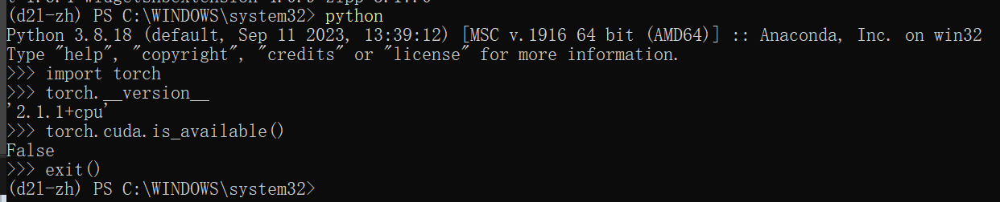

接下来你就可以访问pytorch官网

[Previous PyTorch Versions | PyTorch](https://pytorch.org/get-started/previous-versions/)

从之前的版本中找到自己适合的，我自己选择的是1.13.1

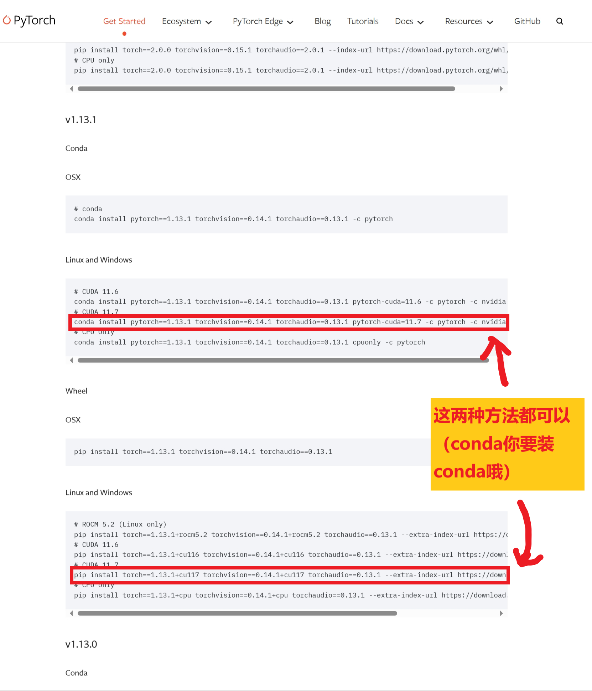

然后就可以根据复制的信息直接在之前的黑窗口中粘贴安装对应版本

> **注意！你们一定要装CUDA，如果对于GPU pytorch安装不熟的移步**
>
> [Pytorch(GPU版)安装 - 知乎 (zhihu.com)](https://zhuanlan.zhihu.com/p/479848495)

然后你就装好他们了，验证一下

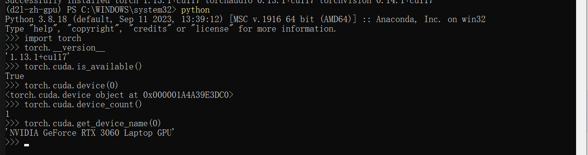

这样你环境就算配好了

接下来去下载d2l-zh和下载d2l-pytorch-sliders的方法视频中讲得很好，建议d2l-pytorch-sliders直接用GitHub Desktop下

### Linux

前面的anaconda换成安装miniconda就好了，或者你安装anaconda Linux版也可，但我觉得miniconda在linux上更适合，其余操作不变，就是如果你开服务器的话用wget下d2l-zh和git安装一下然后下d2l-pytorch-sliders

## N维数组

N维数组是机器学习神经网络的基础，也是主要数据结构

### 分类

#### 0-d（标量）

就是一个数字

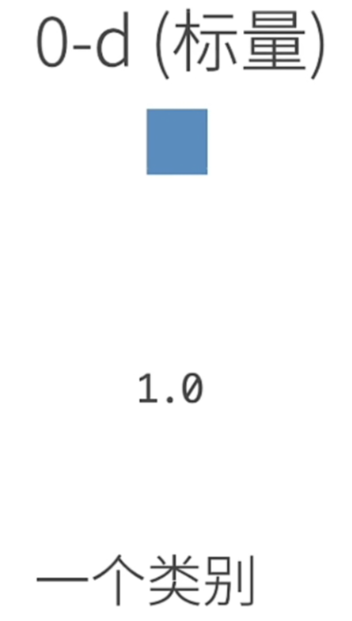

在许多分类问题中他被当作是一种类别的特征，其实分类问题没那么玄乎，其实就是在分布图上画一条线，然后我们可以判断现在的这个值是在线的哪个部分然后我们就可以及逆行判断了

> e.g
>
> 我们判断任意的一个数字是否是一个负数？
>
> x>0正数 x<0负数
>
> 其实这就是原理，这既是一种最为简单的分类

#### 1-d（向量）

这是一个特征值（在机器学习中这样认为！）

其实就是我们在进行表述一个东西的时候我们如何去看待他们（就像我看到一个苹果，但是机器并不会遮掩更直接做出这种语言直接表述，那么他们其实是通过多个不同的特征来理解的【红色的】【有一定形状的】【口感脆脆甜甜的】【闻起来有特殊香气的】……那么人也是这样进行认知的，所以向量就是将我们人的认知的**某一项**归类抽象成为一组数字<为什么要高一组数字捏，直接一个值不好i吗，那当然可能会有问题，就像人判断一个味道是从酸，甜，苦，辣，咸多种味觉入手最终描绘出一个味道，其实这些向量上不同的值就对应于不同的特点，**而且向量多维度描述利于拓展**>，这就是特征向量的由来！）

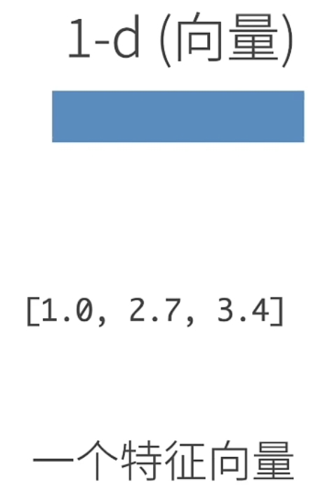

#### 2-d（矩阵）

一个样本（由多个特征值组成）

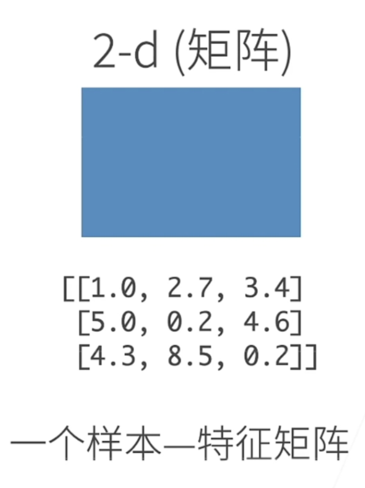

其实这既是描述一个事物（样本了），我们可以由我前面的论述体现到，多特征向量合起来其实就是一个完整样本的表述力！！！（例如视觉+听觉+嗅觉+触觉……人们就可以描述出一个东西啦）

#### 3-d和4-d和5-d

这个其实就是分得更细了，其实就是相关联的东西变多了，表述同一个东西的描述空间更为宽广

> e.g
>
> RGB图片
>
> 其实就是说我们色觉正常的人是通过三原色判断各种颜色的，那么表述丰富了，看到的信息变多力！
>
> 如果我们看到的只是一个2-d矩阵（黑白图片）那我们看到的信息就更少了

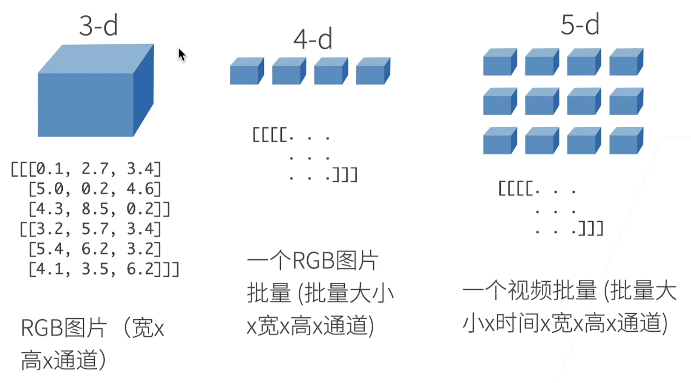

#### n-d

其实d就是维度，一种表现相关数据的数据结构罢了，为多越多越丰富详实

例如：你听到这个人的名字，那么这是一个2-d的东西，你不太知道他，假如你看到他的图片（彩色）那就是3-d感知了，如果你看到他走过来那就是4-d动态感知也有了，你闻闻他，那就是5-d力，和他交流那知道的东西的维度多多得数不清了，那就是n-d啰。

**注意！d维度的分解是：要不相关的东西才能分成一个新维度哦，类似于数学上的要正交，要画x-y平面，x，y完全不相关，一个变化与另一个无关才好！**

### 创建数组

#### 形状

要给出一个具体形状（1x2或3x4或5x6x7……）

#### 要给出元素数据类型

这个是方便计算机做存储的（int float ）[整数，浮点数，定点小数……]

#### 元素的值

给出你给的元素的值

### 访问数组

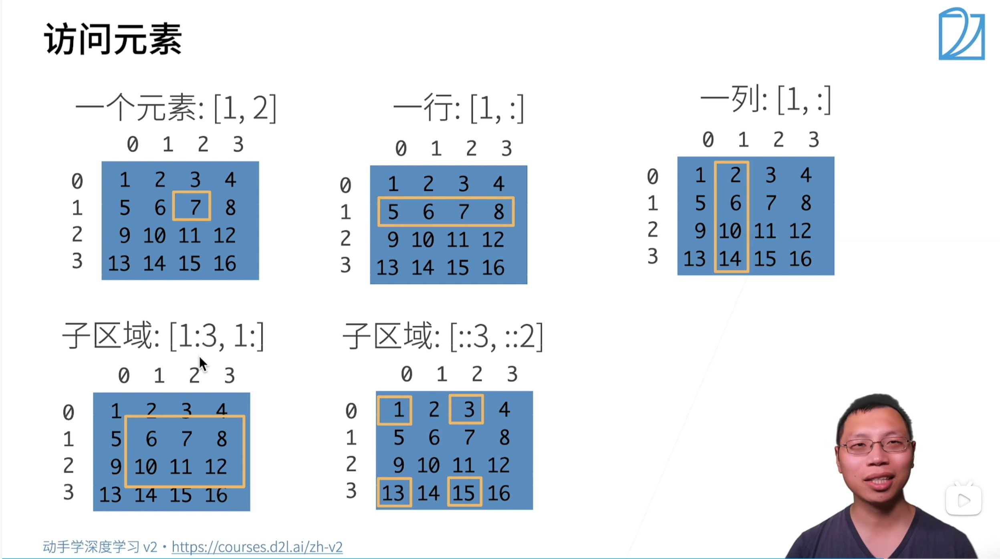

李沐老师给出的表述法是基于python的，不同语言表述方式不一样哦

## 数据操作+数据预处理

### pytorch实操-数据操作

#### pytorch语法

首先先导入

```python
import torch as tor
```

生成一个数组

```python
import torch as tor #import就是导入，as是给torch取别名，之后tor就等于是torch库
x = tor.arange(12)  #arange(n)是生成一个从0到n-1的数组，例如n = 12，则生成的数组是0-11
x                   #用于显示
x.shape             #输出张量的形状
x.numel()           #输出数据的总数（永远是标量）
x.reshape(3,4)      #修改张量的形状而不改变元素的数量和元素值reshape(n,m,……)是将张量改成nxmx……的张量
x2 = tor.tensor([[[x11,y11,z11],[x21,y21,z21]],[[x12,y12,z12],[x22,y22,z22]]]) #套娃造变量
```

自己编程程序见[实操笔记](带代码的实操笔记极其函数库解\00数据操作和预处理\lib_know_data_operator.ipynb "这是一个实操笔记")

> 小贴士
>
> * 注意我们在编写函数时，这个类中最后一个成员函数的使用才是输出，例如：***x.tensor(……).shape***注意shape值才是输出哦
> * 注意我们在写tensor构建张量时，我们可以在元素中加入1.0等这种带有明显虚数意义的值可以使得整个tensor就会被认定为是浮点数^_^

### pytorch实操-数据预处理

数据预处理其实就是把我们非数值的数据变为数值型数据。这里我们主要使用的是pandas这个库。

具体实操看[实操笔记](带代码的实操笔记极其函数库解\00数据操作和预处理\lib_know_data_preprocessing.ipynb "这是一个实操笔记")

### 注意事项

见[实操笔记](带代码的实操笔记极其函数库解\00数据操作和预处理\lib_know_data_operator_preprocessing_tips.ipynb "这是一个实操笔记")

## 线性代数

线性代数是一个数学的基础，其实这里不会涉及过多的线性代数

### 标量

#### 简单操作

- $c = a + b$
- $ c =  a * b$
- $c = \sin\theta$

#### 长度

$$
|a|= \begin{cases}a&\text{a>0}\\-a&\text{other}\end{cases}
$$

$$
|a + b| \leqslant |a| + |b|
$$

$$
|a * b| = |a| * |b|
$$

### 向量

#### 简单操作

- $\vec{c} = \vec{a} + \vec{b} \quad where \quad c_i = a_i + b_i$
- $\vec{c} = k_{标量} \bullet \vec{b} \quad where \quad c_i = k_{标量} * b_i $
- $\vec{c} = \sin \vec{a} \quad where \quad c_i = \sin a_i$

#### 长度

$$
||\vec{a}||_2 = [\sum^{m}_{i = 1}a^2_i]^{\frac{1}{2}}
$$

$$
||\vec{a}|| \geqslant 0 \quad for \quad all \quad \vec{a}
$$

$$
||\vec{a} + \vec{b}|| \leqslant ||\vec{a}|| + ||\vec{b}||
$$

$$
||\vec{a} \bullet \vec{b}|| = |\vec{a}| \bullet ||\vec{b}||
$$

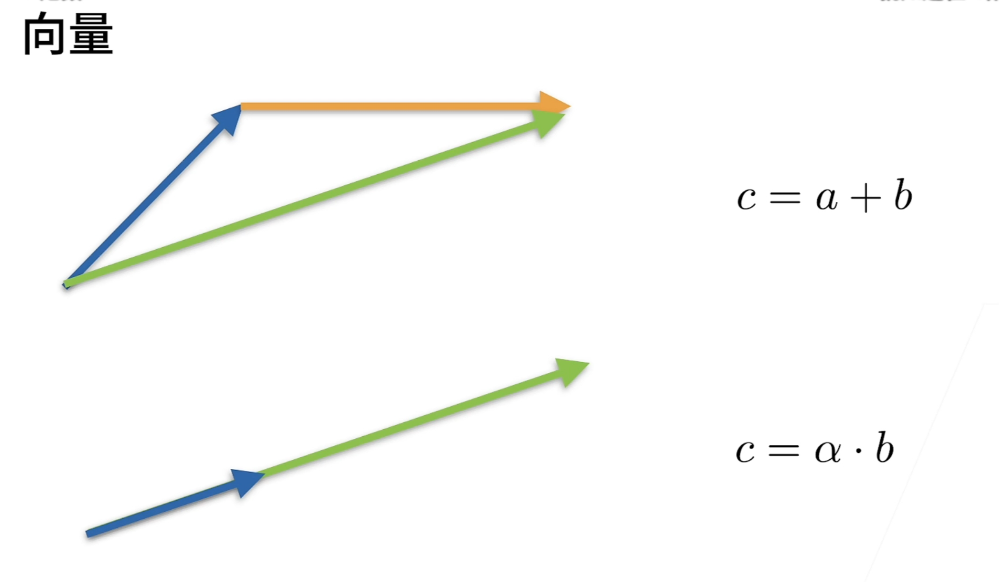

- 向量点乘$\vec{a^T} \times \vec{b} = \sum^{n}_{i}a_i*b_i$
- 正交判定$\vec{a^T} \times \vec{b} = 0$


### 矩阵

#### 简单操作

- $C = A + B \quad where \quad C_{ij} = A_{ij} + B_{ij}$
- $C = k_标量 \bullet B \quad where \quad C_{ij} = k_标量 * B_{ij} $
- $C = \sin A \quad where \quad C_{ij} = \sin A_{ij} $

#### 乘法

$$
\vec{c} = A \bullet \vec{b} \quad where \quad c_i = \sum_jA_{ij} * b_j
$$

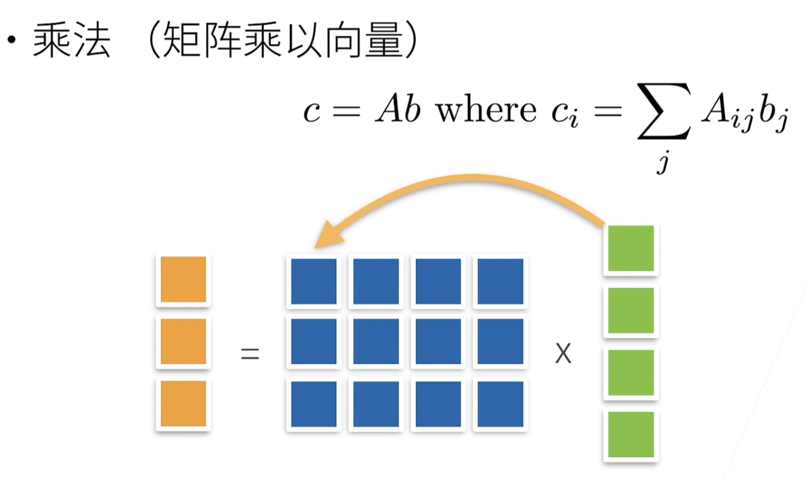

$$
C = A \bullet B \quad where \quad C_{ik} = \sum_jA_{ij} * B_{ik}
$$

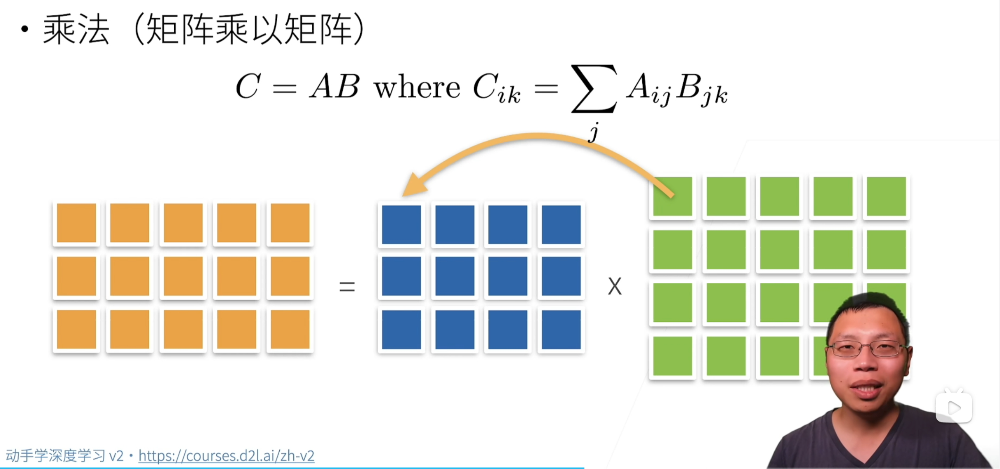

#### 范数

$$
\vec{c} = A \bullet \vec{b} \quad hence \quad ||\vec{c} \leqslant ||A|| \bullet ||\vec{b}||
$$

取决于如何衡量b和c的长度

##### 常见范数

- 矩阵范数：最小满足上述公式的值
- Frobenius范数
  $$
  ||A||_{Frob} = [\sum_{ij}A^2_{ij}]^{\frac{1}{2}}
  $$

#### 对称与反对称

$$
A_{ij} = A_{ji} 对称矩阵
$$

$$
A_{ij} = - A_{ji}反对称
$$

#### **正定**！！！！

$$
||x||^2 = x^T \bullet x \geqslant 0 \quad 推论得出 \quad x^T \bullet A \bullet x \geqslant 0
$$

#### 特殊矩阵

##### 正交矩阵

- 所有行都相互正交
- 所有行都有单位长度$U \quad wth \quad \sum_jU_{ij}*U_{kj} = \delta_{ik}$
- 可以写为$UU^T = 1$

##### 置换矩阵

$$
P \quad where \quad P_{ij} = 1 \quad if \space and \space only \space if \quad j = \pi(i)
$$

- 置换矩阵是正交矩阵

#### 特征向量和特征值

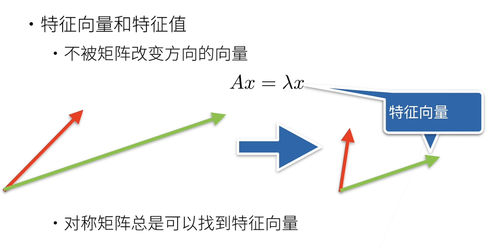

### 线性代数代码实现

代码实时操作(上课跟着做)见[operator](带代码的实操笔记极其函数库解\01线性代数\opreator_linear_algbra.ipynb "操作实时版本")

库操作解析(总结分析)见[Lib库解](带代码的实操笔记极其函数库解\01线性代数\lib_know_linear_algebra_make_true.ipynb "库解")

## 矩阵计算

### 求导数

#### 常见导数

|       $y$       | $a$ | $x^n$      | $e^x$ |    $ln(x)$    | $\sin(x)$ |
| :---------------: | ----- | ------------ | ------- | :-------------: | ----------- |
| $\frac{dy}{dx}$ | 0     | $nx^{n-1}$ | $e^x$ | $\frac{1}{x}$ | $\cos(x)$ |

tips: $a$不是$x$的函数

#### 多函数求导公式

求导公式:

| $y$             | $u + v$                         | $uv$                              |     $y = f(u),u = g(x)$     |
| ----------------- | --------------------------------- | ----------------------------------- | :----------------------------: |
| $\frac{dy}{dx}$ | $\frac{du}{dx} + \frac{dv}{dx}$ | $\frac{du}{dx}v + \frac{dv}{dx}u$ | $\frac{dy}{du}\frac{du}{dx}$ |

#### 亚导数(偏导数)$\partial$

- 发现导数不可微!

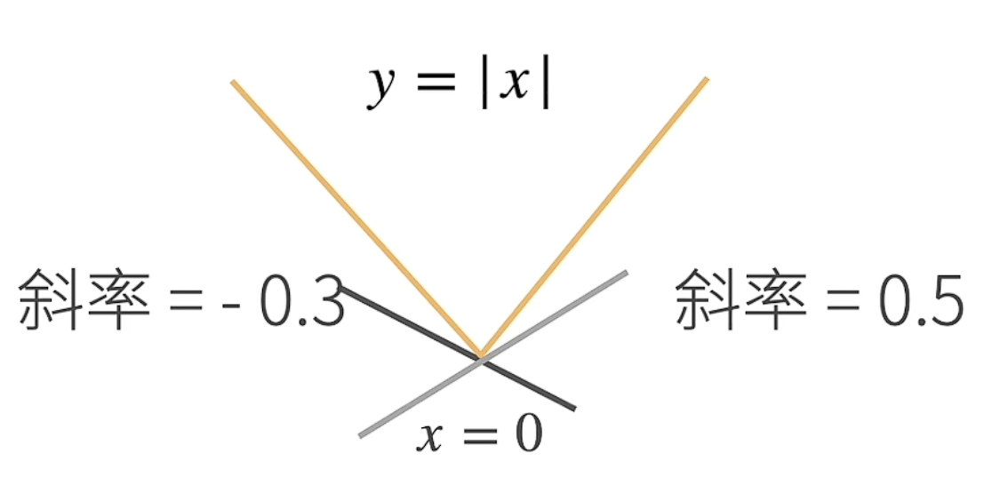

采用分段偏导的方法

$$
\frac{\partial {| x |}}{\partial{x}} = \begin{cases}
 1,\,\,\,x>0\\
 a,\,\,\,x = 0,\quad a \in [-1,1]\\
 -1,\,\,x<0\\
 \end{cases}
$$

- 另一个例子

$max(x,0)$函数

$$
\frac{\partial max(x,0)}{\partial x} = \begin{cases}
1,\,\,\,x > 0\\
a,\,\,\,x = 0,\quad a \in [0,1]\\
0,\,\,\,x < 0
\end{cases}
$$

### 向量求导


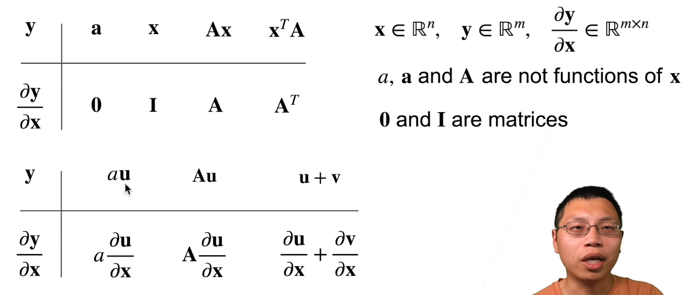

其实就是很简单的一个问题，我们可以发现！其实 $x_n$ 就是一个个维度，偏导其实可以理解为同纬度计算，非同纬度其实就是常熟，同纬度其实就是可以进行正常求导的玩意。

## 自动求导

### 链式法则

推荐李宏毅的视频。

#### 求导方法二则

##### 公式法

利用公式进行各种个样的操作

##### 数值法

其实就是将变量进行做差，求导项趋于0

#### 计算图

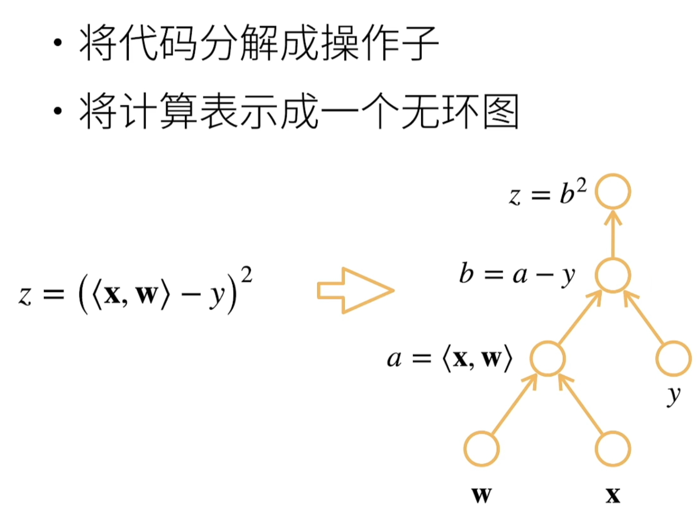

### 两种模式


> 例子
>
> 

反向算法总结(建议这一部分看李宏毅老师的课程)

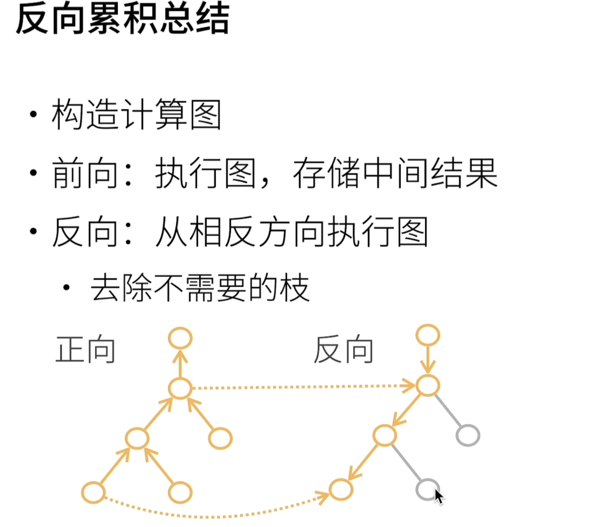

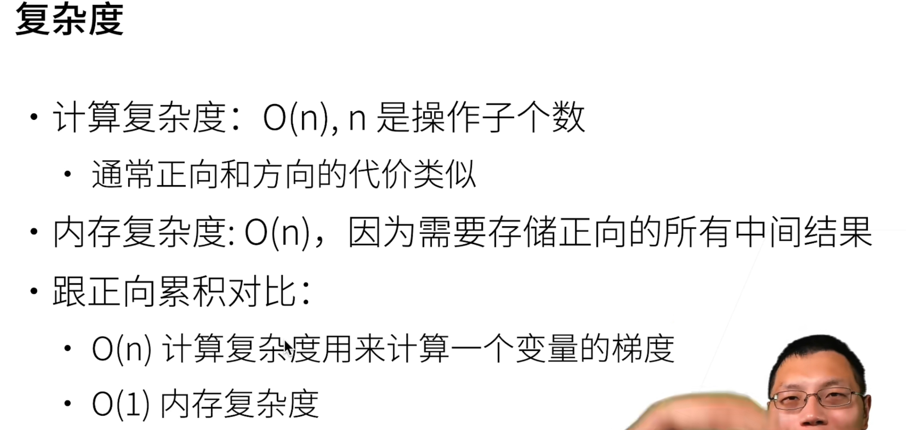

我们其实可以在这里发现一个有趣的现象

- 我们的数据使用时，我们的顺向其实时一个符号计算，那么前因后果都要知道
- 反向计算其实是一个数值计算，啊u哦一我们就可以直接去存前面的数值就好了，不需要去将整个付哈哦体系都搞一遍

### 自动求导实现

详情见[实操笔记](带代码的实操笔记极其函数库解\02自动求导\lib_know_autograd.ipynb "实操笔记")

## 线性回归

### 引入：买房子

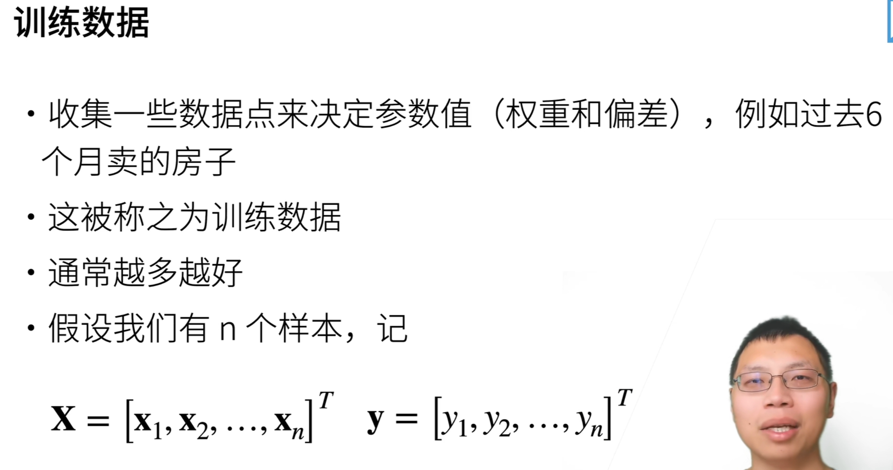

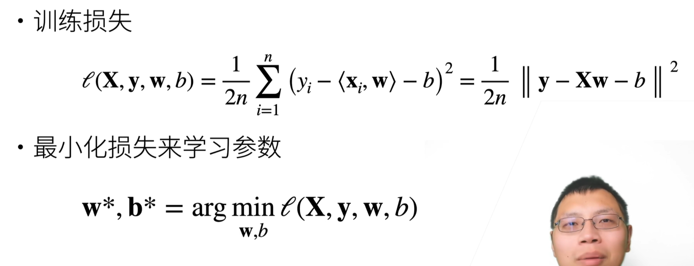

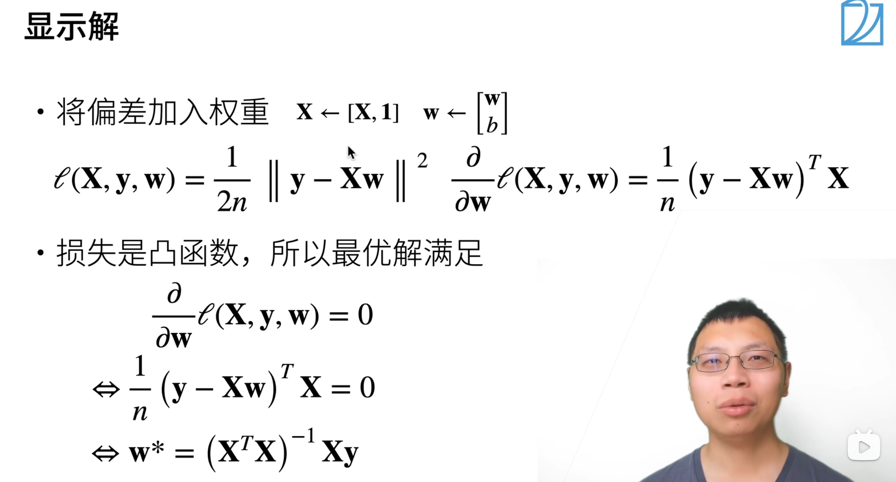

### 最优化方法

#### 梯度下降

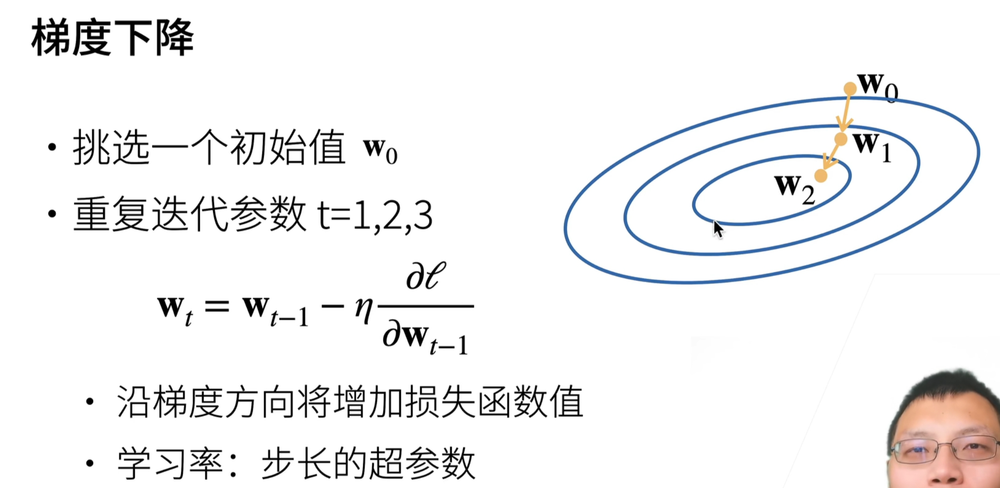

我们其实就可以用一个公式来解决这问题

$$
w_t = w_{t - 1} - \eta*\frac{\partial loss}{\partial w_{t-1}}
$$

其中 $\eta$ 是一个**超参数(hyper parameter)**

超参数其实就是我们需要自己调整的参数，这个不是由机器学习可以优化得来的参数，这个$\eta$参数被乘称作学习率，用于表示迭代的幅度(直观体现就是快慢)

##### 梯度下降策略

对于学习率这个超参数的调整

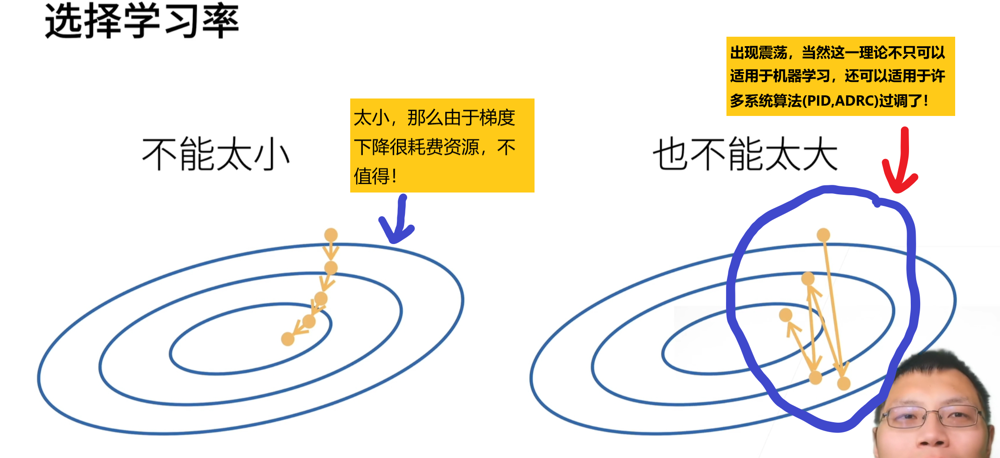

对于如果我们要计算一个训练集上的上的loss，其实我们会因为要计算的数据过多就会导致我们的训练时间太长

> 例如一个集有1000_000_000个数据，首先我们要算出loss其实就是我们要将数据在模型中跑一遍获得一个值，这个值与正确值做比对得到loss，那么如果整个就要跑1000_000_000次！
>
> 于是未来使得我们的速度变快，我们就其实是采用分块的方式进行，这样我们可以进行一定程度的并行，这样我们可以在一个时间内做出更多的事。并且我们对于原始数据分批次训(就是缩小一次迭代所i需要计算的数据量)
>
> 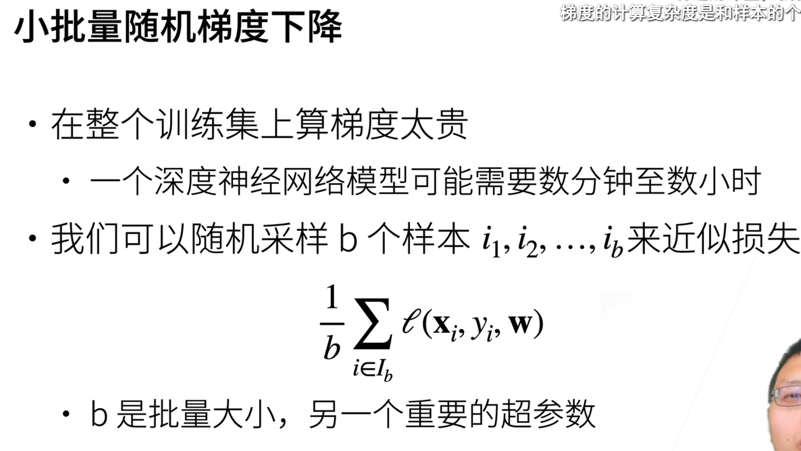
>
> 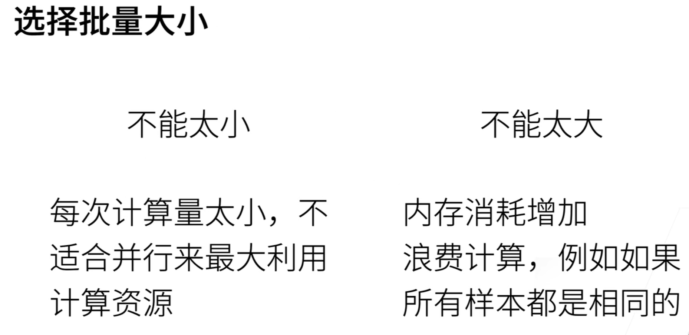

梯度下降其实就是沿着反梯度的方向进行更新求解就好了。

### 线性回归算法从零实现

从零实现整个方法(带库的)

- 数据流水线
- 模型
- 损失函数
- 小批量随机梯度下降优化器

详见

[库解](带代码的实操笔记极其函数库解\03线性回归\lib_know_linear_regression-scartch.ipynb)

[实操笔记](带代码的实操笔记极其函数库解\03线性回归\operator_linear_regression-scartch.ipynb)

### 线性回归算法简洁实现

其实就是调用了一些库，会更快更简单，程序可读性更高

[库解](带代码的实操笔记极其函数库解\03线性回归\lib_know_linear_regression-easy.ipynb)

[实操笔记](带代码的实操笔记极其函数库解\03线性回归\operator_linear_regression-easy.ipynb)

## Softmax回归

这其实是做为一种分类模型去看的，是一种分类器

### 回归vs分类

- 回归是去预测一个未来的值
- 分类其实是去做一个函数然后依据我们的点在函数的哪个区域来决定是什么类别

#### 回归

- 单连续值输出
- 自然区间R
- 损失就是真实值与其预测值之差

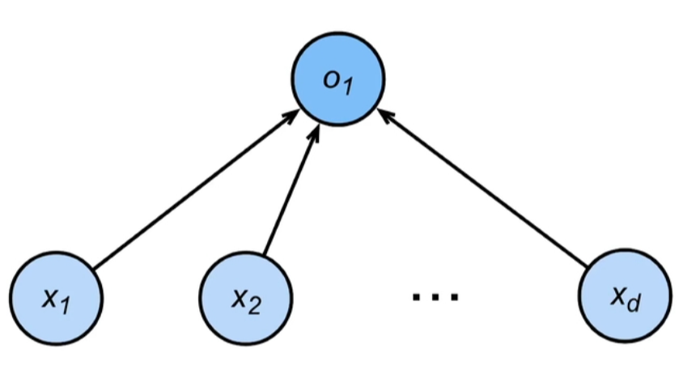

#### 分类

- 输出多个值
- 其实就是多个不同类置信度(输出的值)

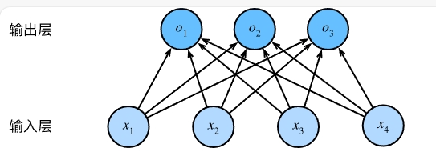

### 分类问题数学基础

对分类问题进行一位有效编码

> 例如：有n个类别，那么就是把一个做一个长为n的数组就好了
>
> $$
> y = [x_1, x_2 ,x_3……]
> $$
>
> 我们可有如下式子：
>
> $$
> y_i = \begin{cases} 1\quad if\quad i = y\\ 0\quad others \end{cases}
> $$
>
> 我们使用均方损失训练就是(差平方)
>
> 在进行选择时其实就是我们去选择最大的一个置信度的值就好了
>
> $$
> \hat{y} = argmax(o_i)
> $$

#### 无校验比例

就是我们在进行分类的时候可能会有一些数据是无效的，那么这款里就需要我们进行数据的的辨识，去筛除我们的无效的数据类(就是判别出来是类A，但其实不是，是因为他不在分类中，只是因为最像类A所以分为类A)

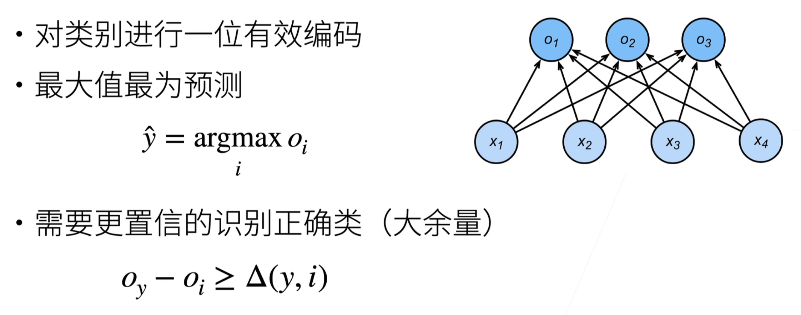

关注的是一个相对值

#### 校验比例

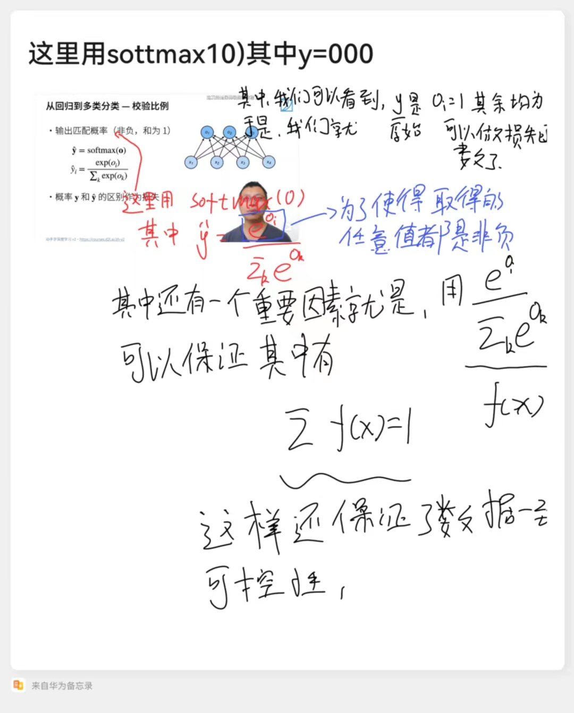

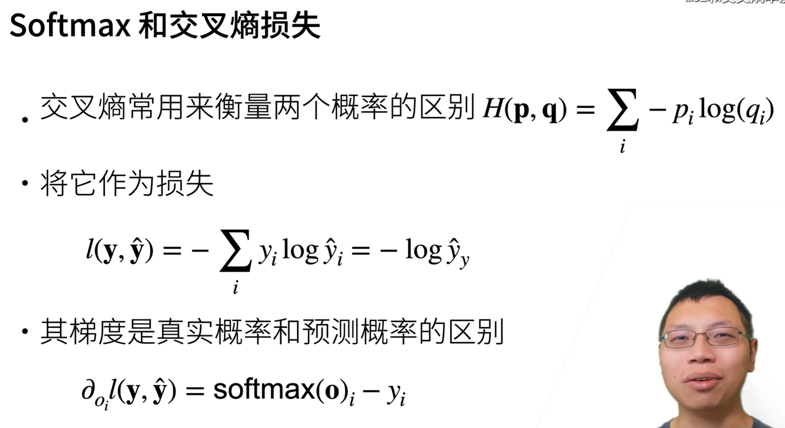

这里用到了通信中信息论的一个概念就是我们可以看到，其实在信息论中交叉熵就是两个信息的相关程度所以我们使用交叉熵作为损失函数。

其实原则还是差异分析罢了。

### 从零实现

这是一个深度学习中举足轻重的方法，这是一个实现，之后所有操作的举足轻重的方法

[从0到1实操笔记](带代码的实操笔记极其函数库解\04Softmax\operator_softmax_021.ipynb)

[简洁实现实操笔记](带代码的实操笔记极其函数库解\04Softmax\operator_softmax_easy.ipynb)

[softmax小贴士](带代码的实操笔记极其函数库解\04Softmax\softmax_tips.ipynb)

## 损失函数

损失函数其实对于机器学习而言时一个很重要的参数或者是配置点，其实就是我们有不少的论文就是通过修改损失函数以获得不同的效果，然后得以发表。

### L2 Loss

平方损失函数

$$
l(y,y') = \frac{1}{2}(y - y')^2
$$


更新速度随着距离会发生改变(远处更新速度过快，可能超调)

### L1 Loss

绝对值损失函数

$$
l(y,y') = | y - y'|
$$


更新速度随着距离不变，较为稳定(离正确点远的地方更新稳定，不会过大，但是近处更新可能有问题)

### Huber's Robust Loss

就是一个函数的融合

$$
Loss(y,y') = \begin{cases} |y - y'|\quad if\quad |y - y'| > 1\\ \frac{1}{2}(y - y')^2\quad others \end{cases}
$$

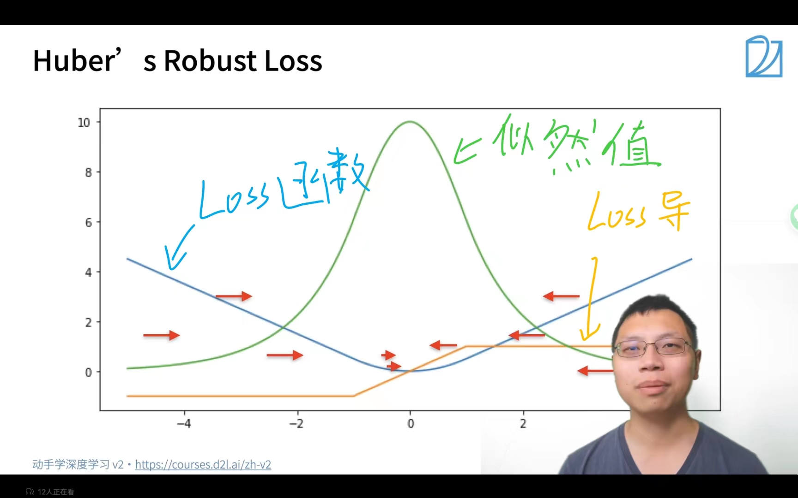

## 图片分类数据集(很重要，很多都搞，所以单独抽出来讲)

详情请见[实操笔记](带代码的实操笔记极其函数库解\04_1图像分类数据集\operator_image_Fashion-MNIST.ipynb)

当中我们使用了许多有关Fashion-MINIST的操作，现在是对于相关部分的整理，但这个篇章主要还是在实操这个是详情请看[Fashion-MINIST函数抽象](带代码的实操笔记极其函数库解\04_1图像分类数据集\lib_know_image_Fashion-MINIST.ipynb)

## 多层感知机

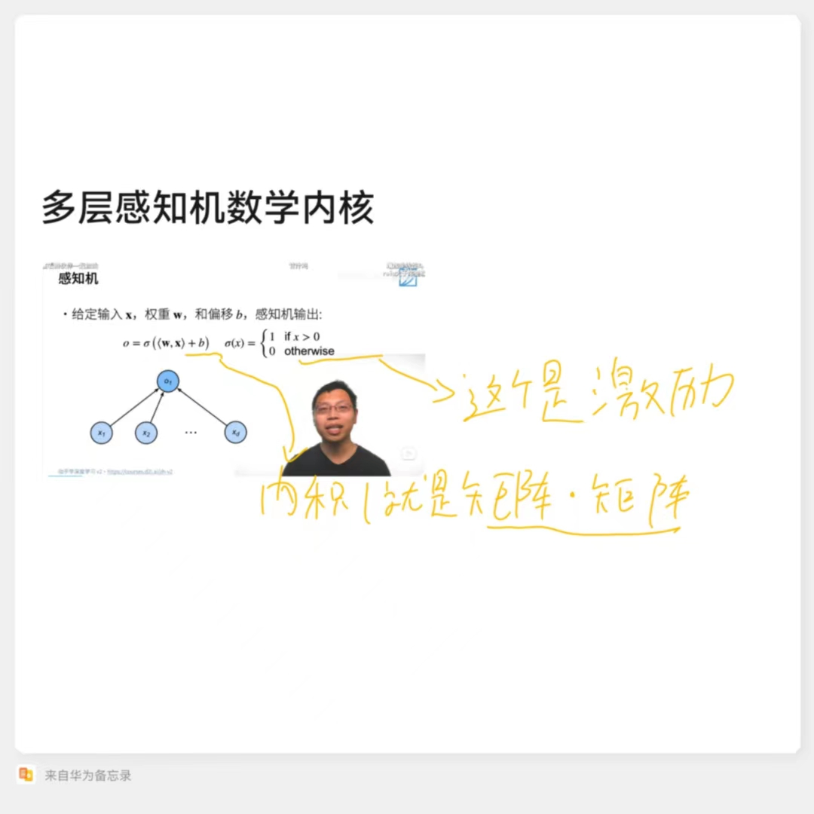

### 感知机

- 感知机其实就是一个简单的二分类函数。或者说你可以将他认为是一种特殊的softmax

$$
o = \sigma(\langle \pmb w,\pmb x  \rangle + b) \, \,\,\,\,\,\,\,\, \sigma(x) = \begin{cases} 1 \quad \quad x > 0\\ -1 \quad 其他 \end{cases}
$$

- 这里只能做二分类问题
- 相比于线性回归输出的是实数，我们这里仅输出离散的值
- 相比于一般的softmax这里仅可以进行二分类问题

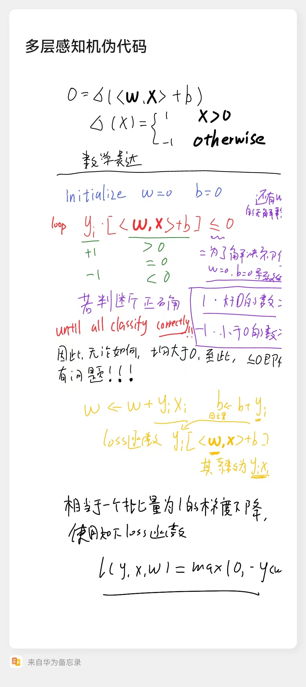

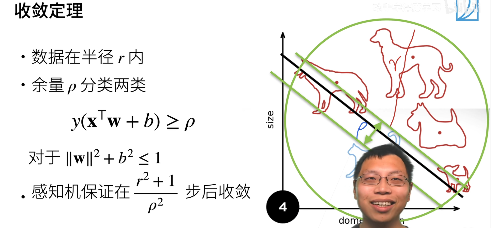

#### 感知机问题——XOR不可拟合

由于其是一个线性模型，所以对于分类只能进行画一条线，但是XOR问题明显是需要两条线所以嘎庙之机难以拟合他们(Minsky & Papert 1969年提出)

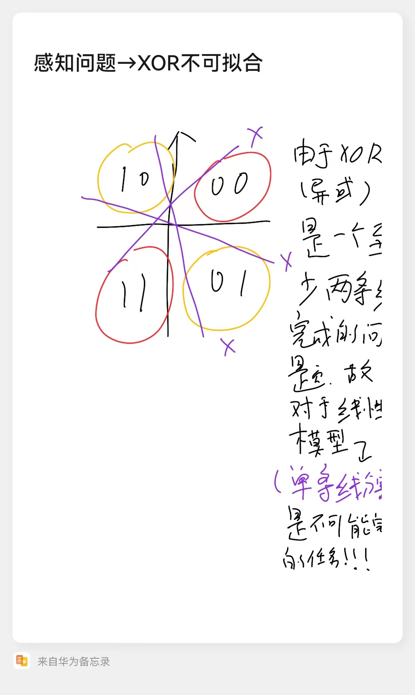

**导致了AI的第一次寒冬**

### 多层感知机

#### 学习XOR

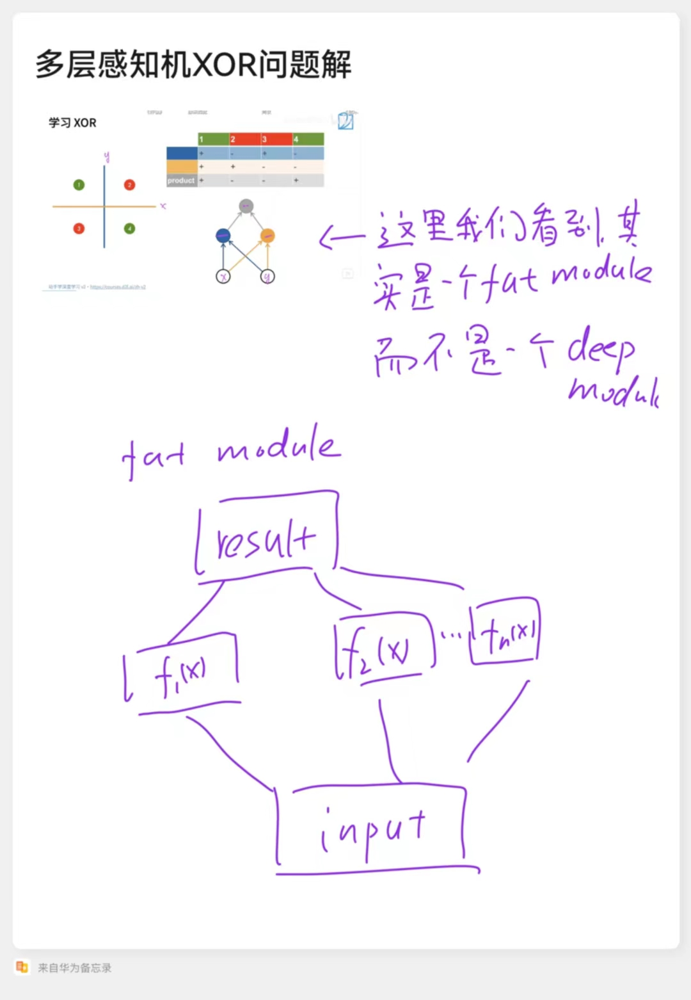

注意这里再进行实际的操作时使用的方法其实是先对于x进行判断，在对于y及逆行判断

#### 隐藏层

其中我们可以看到就是我们的$f_1(x)……f_n(x)$其实就是我们说的 **hidden layer** (隐藏层)

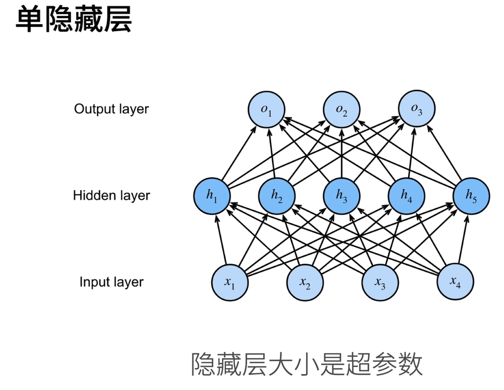

对于h其实是有 $ h = \sigma(W_1x + b_1) $ 这样的数据作为一个输出的这是一个数值输出，其实就是搭建一个神经突触(激活函数其实就是我们的一种阶跃跳值方法，其实就是类似于使得我们的数据能够表示更多的函数可能)$ \sigma $ 是元素级激活函数。

接下来输出，其中有如果作为但分类那其实就是一个softmax那么其实还是计算一个数值 $ o = w^T_xh = b_2 $ 其中有意思的点其实就在于我们是有激活函数的只不过是直接放到了最后。

#### 多类分类

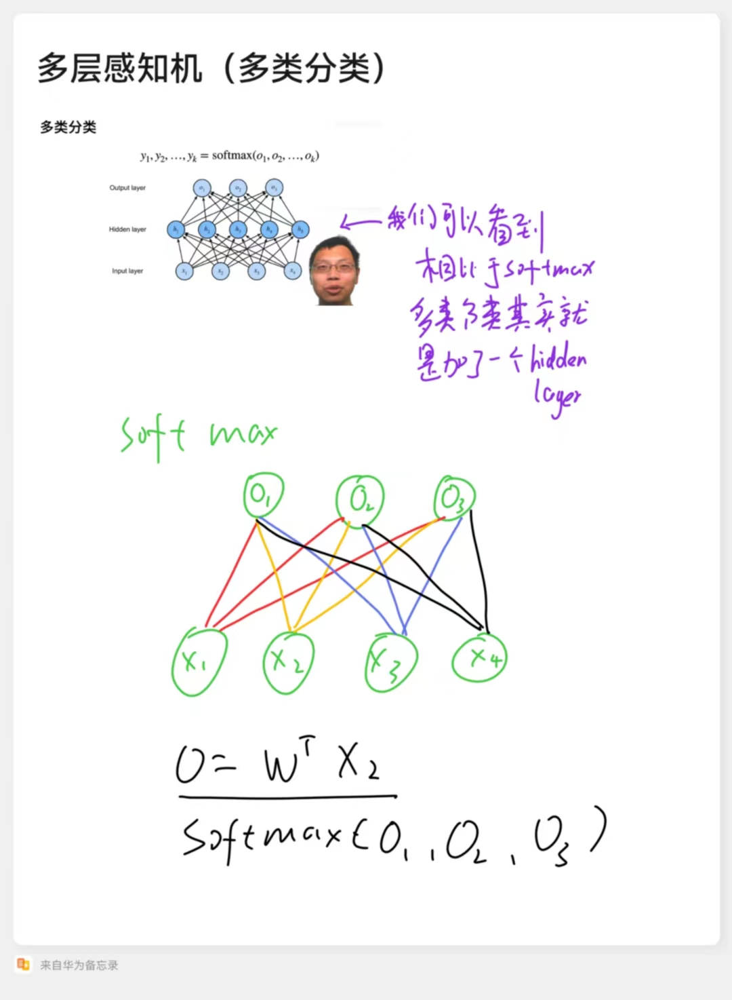

#### 多隐藏层

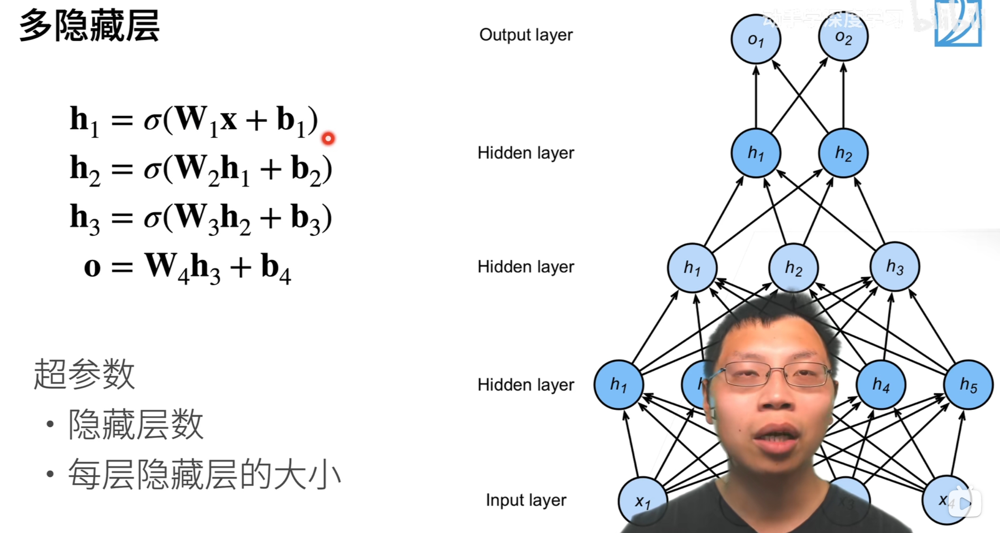

**每层有自己的激活函数对于隐藏层其实出来还是一个向量。**

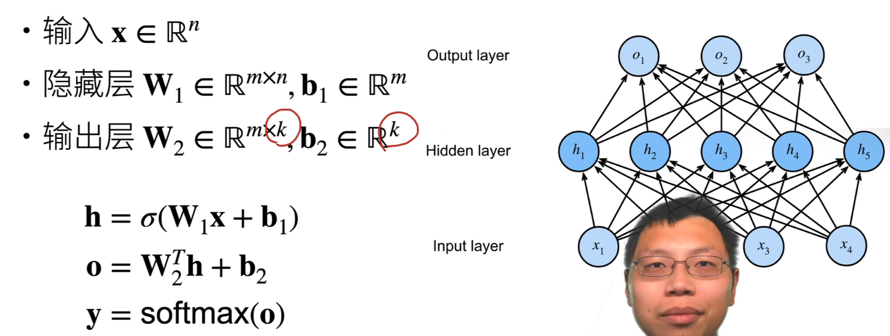

超参数

- 隐藏层数
- 每层隐藏层的大小

##### 设计思路

其实我们可以看到我门在设计一个hidden layer的时候其实是我们自己对于数据进行相关的操作，我们可以看到一般在操作中我们是倾向于将一个数据进行一种由多变少的操作方法，我们可以看到有一些操作其实是我们在输入的第一层隐藏层我们会"展开"他们，就是将他们例如128个输入变化为256个第一级输入。我们一般在第一层不进行压缩，在后面的层中再进行压缩。第一层压缩后我们其实是担心数据还原不出来！另外，有的输入是在第一层进行了一些压缩的，其实是担心过拟合问题，就是为了这个去学这个(就像高考一样，高考就是在将学生进行机器学习，有时候就过拟合了，然后思路就被阻滞了，活化不了了，哈哈哈)，最终导致我们的模型在实际使用的时候我们无法得到很好的效果，但是在测试集上我们有相当的效果。

#### New Thinking**

机器学习其实可以看作时一种压缩其实就是将一个较为复杂的问题我们转到一个较为简单的输出中去！

信息提炼

#### 经典激活函数sigmoid

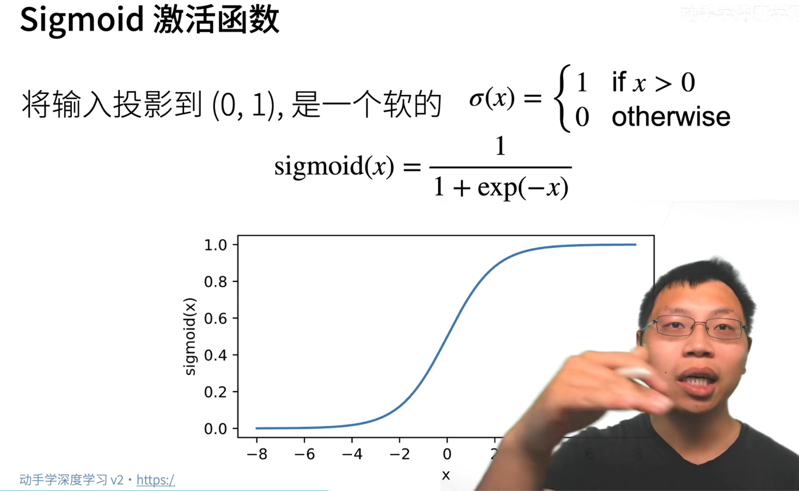

不采用阶跃函数而是采用 $ sigmoid = \frac{1}{1 + e^{-x}} $ 这个函数其实就是方便求导。(soft version)

#### 经典激活函数Tanh

**将输出投影到(-1,1)的阶跃函数**

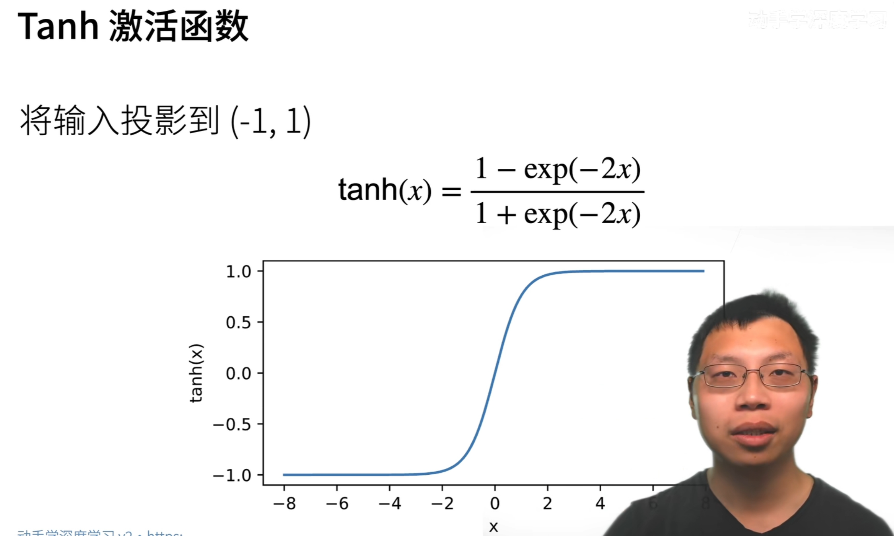

注意其中的-2就是为了在求导数时方变计算。

#### 经典激活函数ReLU

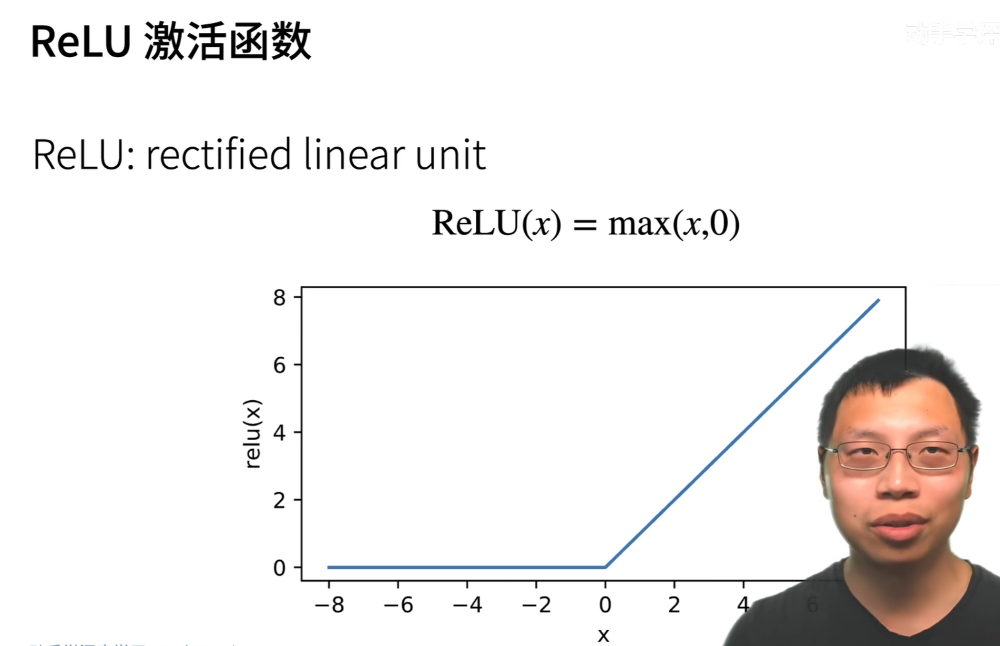

用得最多，其实就是一个简单！

### 为什么我们使用deep而是使用fat

其实就是我们的在进行机器学习时我们可以看到一个有趣的点就是过拟合

过拟合会导致我们学的东西变为一种公式化，就像大家在高考时选择题的答题技巧("三短一长选最长，三长一短选最短，长长短短选BD，物理看到有”绝对“的字眼就是错的"等问题)，我们其实是希望模型去做解释，而不是去"投机取巧"，这是一个严重的问题。而当我们的参数变得fat而不是deep时，我们就会发现其实我们一口气想将数据并行，信息一并接入那么就会导致我们去**过度臆测**信息，导致我们overfitting

此外，deep更好训练

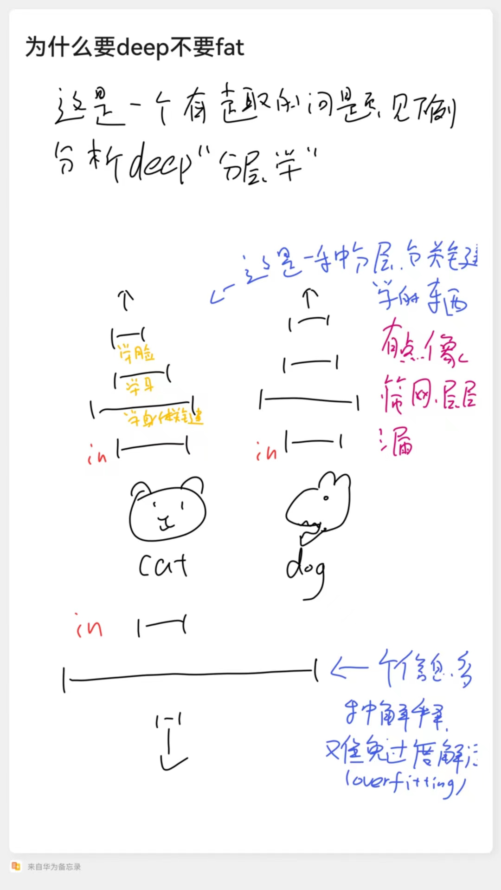

## 模型选择-过拟合-欠拟合

### 训练误差与泛化误差

- 训练误差：模型在训练数据上的误差(模拟)
- 泛化误差： 模型在新数据上的误差(实际用)

### 验证数据集与测试数据集

- 验证数据集：用于评估模型好坏的数据集（知结果，知道输入，但是并不训练他们）【一般的test data】
  **不要与训练数据集回到一起**（常犯错误）
- 测试数据集：只用一次的数据集（其实就是真实的情况了，遛遛模型）

#### K-则交叉验证

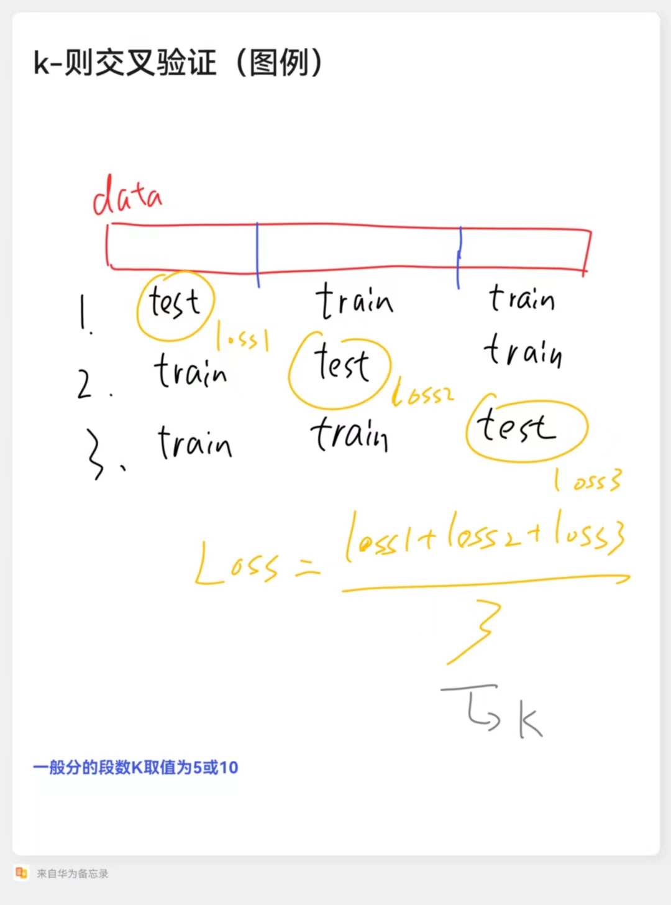

### 过拟合与欠拟合

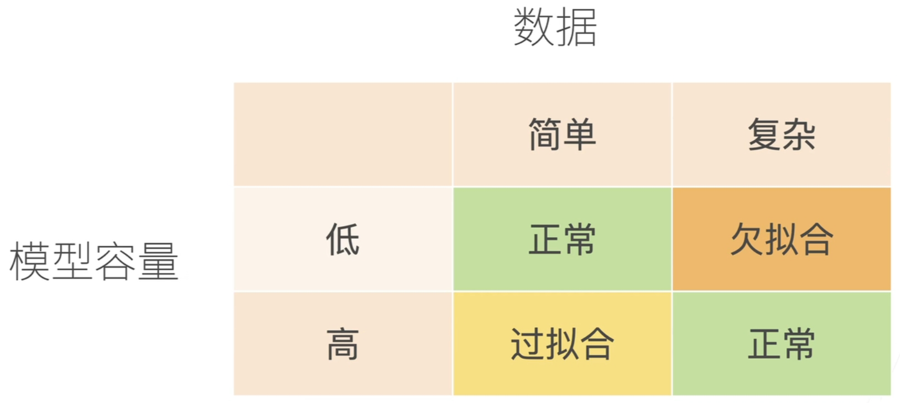

- 模型复杂：就是这个模型的体量
- 数据复杂：就是这个数据集的大小

#### 模型容量

- 拟合各种函数的能力
- 低容量模型难以拟合训练数据
- 高容量模型可以记住更多的数据细节

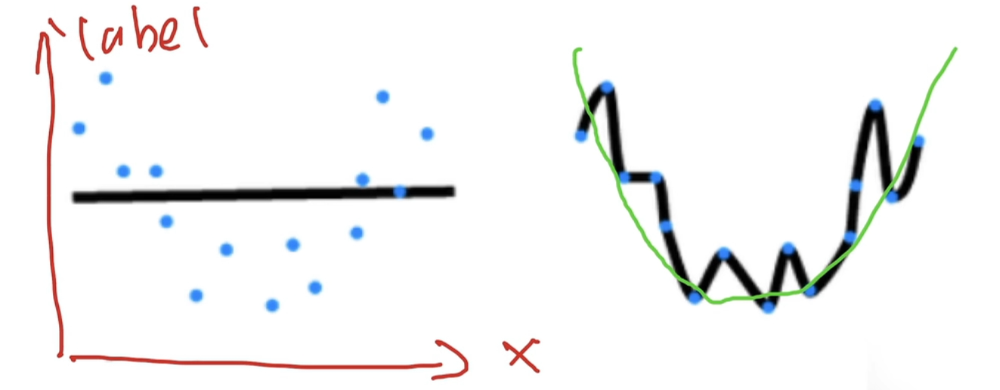

##### 模型容量的影响

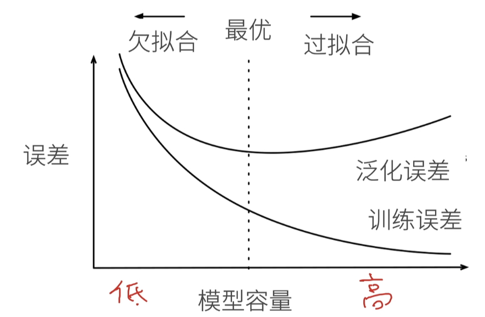

我们可以看到随着模型容量的上升，我们的**训练误差**疯狂下降(例如我们用与识别一个数据集中是猫还是狗，如果过大的模型就会直接记住每一个凸显更多编号，那就完蛋了！)，大容量的数据可能会不经意间放大噪声，最终导致我们的信息被错误的提取在最终出现问题。

我们还可以看到就是我们的泛化误差在先有下降再进行上升的，这就是因为我们的模型其实是应为当我们投入大量数据后产生的对于噪声也进行学习，这困扰了模型，导致他们最终泛化能力是会下降的。

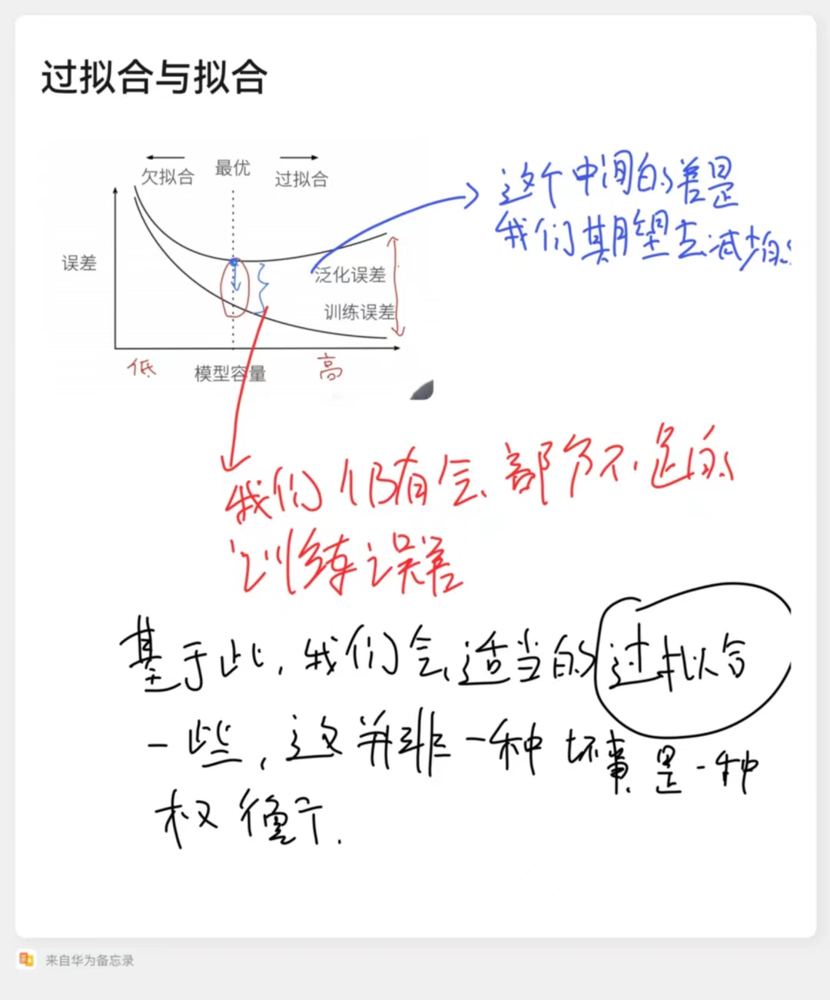

#### 模型比较

不同种类间的模型是不好比较i的

给定一种模型，旗标叫方法主要有两个因素

- 参数的个数
- 参数值的选择范围

### VC维

- 统计学习理论的一个核心思想
- 对于一个分类模型，VC等于一个最大数据集的大小，不管如何给定标号，都存在一个模型对它进行完美分类(一个模型总是有方法记住数据集)

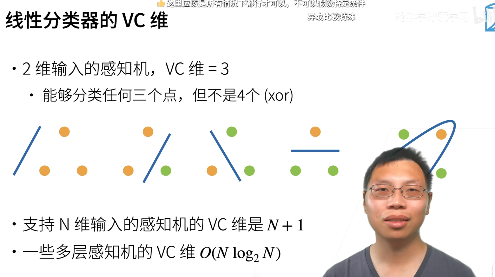

所以才说异或是一个AI寒冬

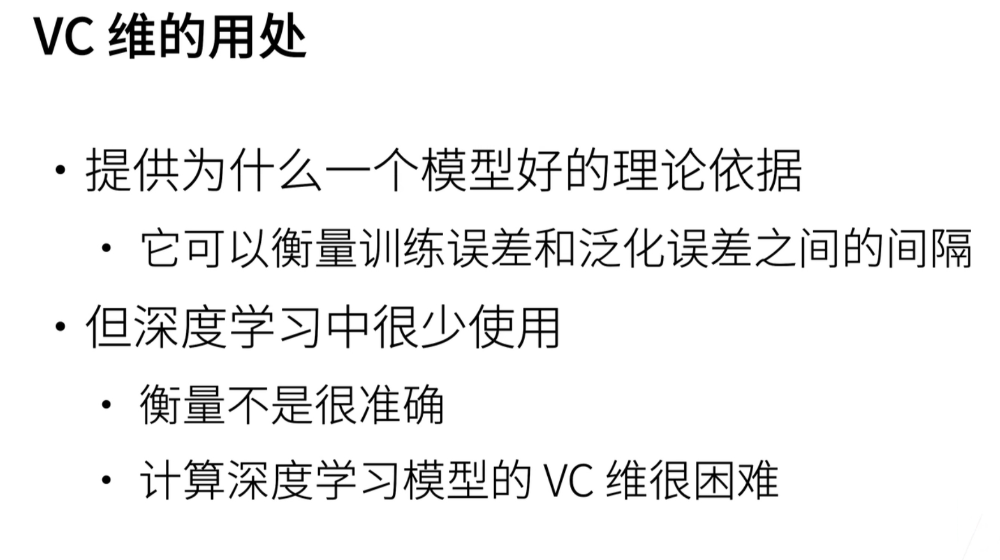

### 数据复杂度

#### 多个重要因素

- 样本个数
- 每个样本元素个数
- 时间、空间结构
- 多样性、

## 模型选择过拟合与欠拟合样例

直接见李沐老师的笔记

## 权重衰退--(处理过拟合的方法)

我们可以知道我们的模型容量其实是由

- 参数数量
- 参数选值范围

以上两点进行操作的

权重衰退聚焦于去做参数选值范围的操作进行防止过拟合

### 限制方法

#### 刚性限制

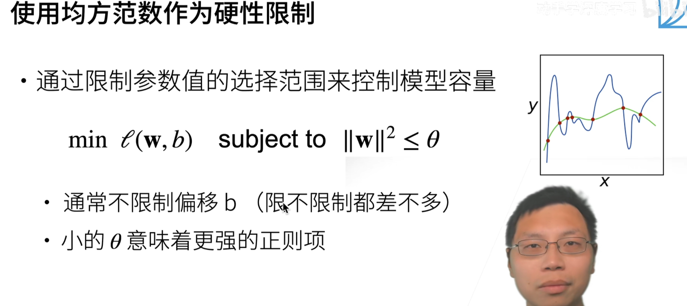

其实就是我们的数据对于 $w$ 作为一个限幅，其中 $\theta$ 数值的大小就体现了他们的约束力度。

#### 柔性限制

另一种方法是采用柔性限制(一般常用的方法)

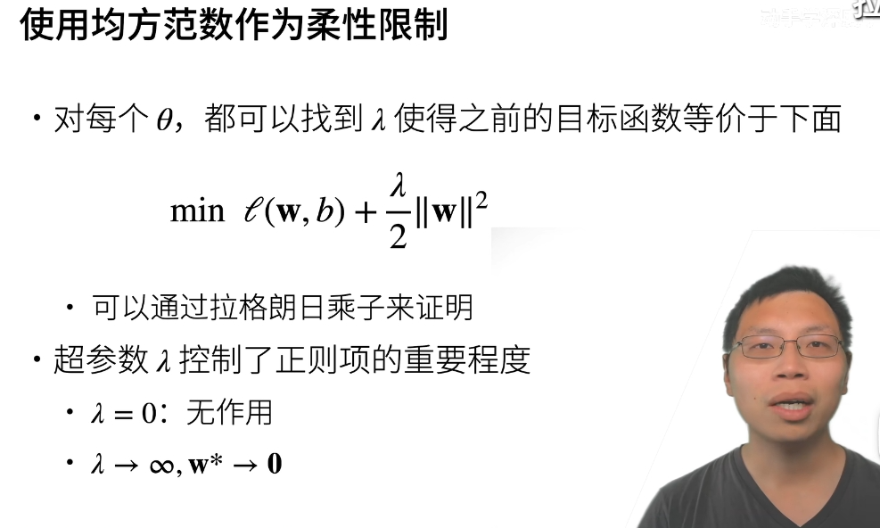

对于上述操作的理解

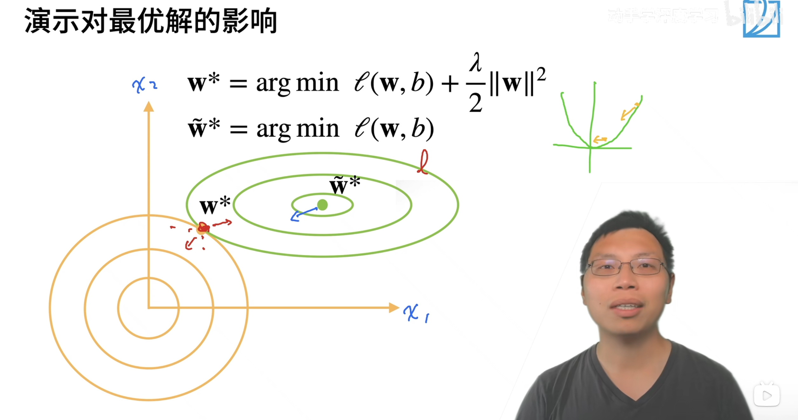

对于该图的解释如下：

其中我们可以看到就是我们的 $w$ 这个参数在没有人掣肘的时候我们的参数值其实是可以遍布整个平面的，那么在这样的操作下就会导致我们你的数据选择就会过于宽泛。那么为了解决这个问题，我们就会引入 **$ \frac{ \lambda }{2}|| w||^2 $** 这个+项来自作为引导，这个就是途中黄色的部分，这是我们可以看到一个有趣的现象，就是我们找的最小值不仅是loss的最小值了，还有就是要权衡 $loss(w,b)+\frac{\lambda}{2}||w||^2$的最小，也就是说我们引入了 $||w||^2$这个值，我们的值还要受到那个weight权重大小的影响，因此这样的评判标准下weight权重就不会太大，这就无形中限制了权重的操作范围，nice！

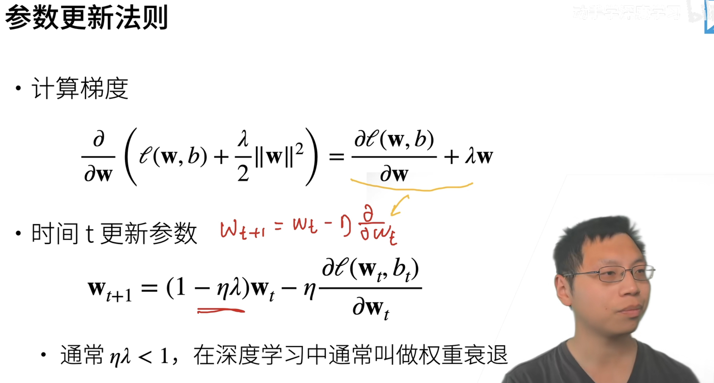

这里我们就可以将这个权重衰退看得更为清楚，这里我们可以看到，由于我们之前引入了一个加绝对值的操作，那么我们在后续的更新时我们会多减去一个东西最终会导致最下面那个式子的效果 $ (1-\eta\lambda)w_t$ 原本数据更新时是去减 $w_t$ 的，现在变成了是减去一个小于原本weight的数值，这就是权重衰退！

### 权重衰退的现实实现的一些亮点

我们在进行权重衰退的现实的计算使用时我们会有一些区别就是我们将其中的 $\lambda$ 作为一个参数取入（一般取一个小值0.001等等)

## 丢弃法(dropout)

效果可能会比权重衰退要好

### 动机

一个好的模型需要对输入数据的扰动格鲁棒(噪声不敏感)

- 使用有噪音的数据等价于Tikhonov正则
- 丢弃法：在层之间加入噪音

#### 无偏差加入噪音

- 对于 **x** 有，加入噪音得到 **x'** ，我们希望：

  $$
  E[x'] = x
  $$

  也就是 **x'** 的期望仍等于 **x** 的期望
- 丢弃法对于每个元素进行如下扰动：

  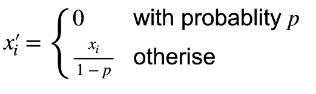

> 期望计算：$E(x') = 0 x p + (1-p)x\frac{x}{1-p}=x$

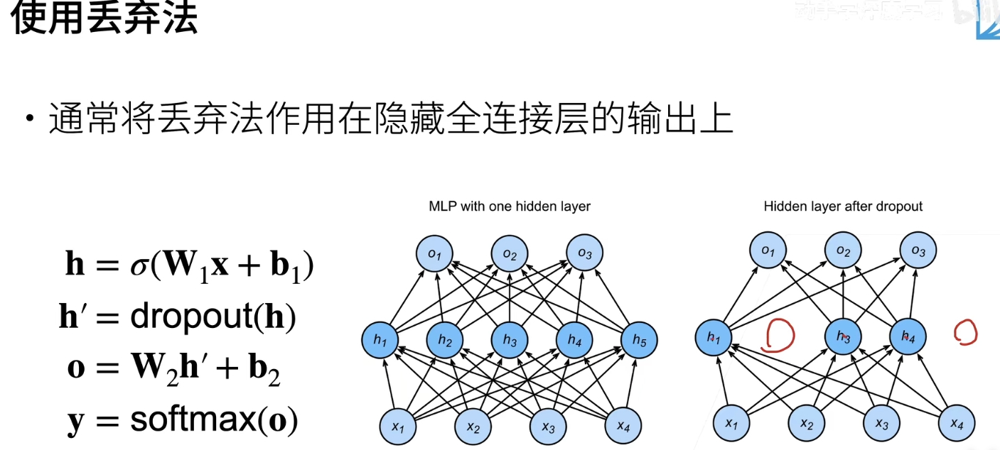

部分层中的数值变为了0

注意就是这个dropout仅在训练中使用，而在推理中是不使用的，也就是我们将最好的一个dropout出的一个直接作为模型，在推理过程中我们的模型各个参数并不发生改变。保证稳定输出。

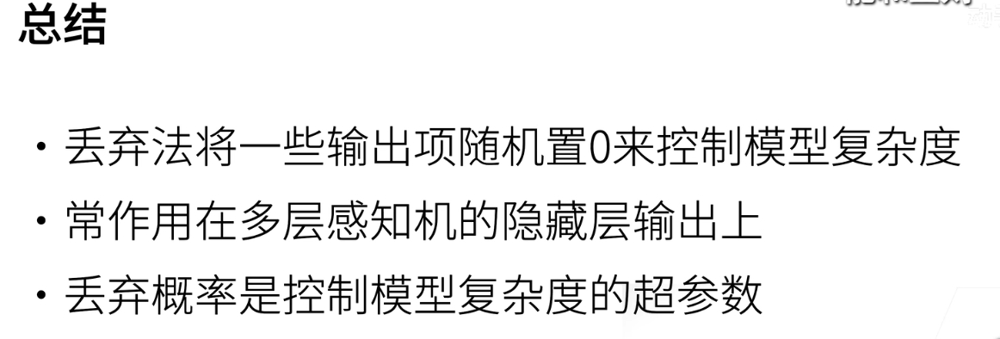

基本不用于CNN上

0.5，0.9，0.7，0.1

## 数值稳定性

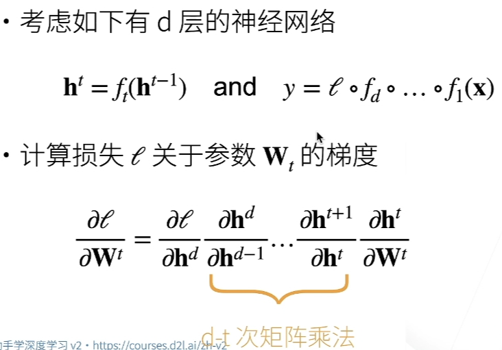

我们知道我们的数字的计算应用的是链式法则(开环求导)那么是一层层求下来的，那么就看可能会导致数值爆炸！

如果每个梯度大于1，一个100层的模型：$ 1.5^{100} \approx 4\times 10^{14}$

如果每个梯度小于1，一个100层的模型：$0.8^{100} \approx 2 \times 10^{-10}$

### 训练更稳定

- 目标：让梯度位于合理的范围内
- 乘法变加法
  ResNext，LSTM
- 归一化
  梯度归一化，进行裁剪(设限)
- 合理的权重初始化和激活函数

## 快速操作

### Pytorch搭建神经网络基础

[模型构建](带代码的实操笔记极其函数库解\08pytorch快速操作\module_build.ipynb "nodule_build")

[层构建](带代码的实操笔记极其函数库解\08pytorch快速操作\layer_buils.ipynb)

[参数管理](带代码的实操笔记极其函数库解\08pytorch快速操作\param_manage.ipynb)

[文件读写](带代码的实操笔记极其函数库解\08pytorch快速操作\read_and_write.ipynb)

## 使用GPU

默认情况下，我们的所有模型都是在cpu上进行操作的，物品们要将他们转换到GPU上运行，另外前提是你有GPU，至于安装环境等你可以看各种教程，直接搜索就好，这里不做过多赘述(注意：pytorch实际主要调用的是cudann，而不是cuda要注意！)

[GPU使用](带代码的实操笔记极其函数库解\09GPU使用(单GPU)\operator_gpu.ipynb)

## 卷积

### 初识卷积

在图像中我们会看到，作为一个矩阵，其中像素点十分多，如果此时使用全连接层就会显得十分的多余（图像所执行的任务一般是识别或者分类），其实我们在图像中横夺时候只是需要获取部分信息，没有必要全盘接收。


我们可以看到我们的图像使用有如下两个特点

- 平移不变性
- 局部性

#### 重新看向全连接层

在之前的手写数字识别中我们是将图片转换成一个个向量(数组)去操作，这就导致我们会忽略空间信息(x, y可以形成位置相关的信息)。

因此我们仿照全连接层做如下操作

- 将输入和输出变形为矩阵（宽度，高度）
- 将权重变形为4-D变量(h, w)【原图片】=>(h', w')【卷积核】

  $$
  h_{i,j} = \sum_{k,l}w_{i,j,k,l}x_{k,l} = \sum_{a,b}v_{i,j,a,b}x_{i + a, j + b}
  $$
- $v$是$w$的重新索引$v_{i,j,a,b} = w_{i,j,i+a,j+b}$
- 注意：其中$i,j$是图形的长宽下标

##### 原则 #1 - 平移不变性

- 如果按上式操作$x$平移会导致$v$也会发生平移$ h_{i,j} = \sum_{a,b}v_{i,j,a,b}x_{i+a,j+b}$
- 但是由平移不变性$v$不应该依赖于(i,j)
- 解决方法：$v_{i,j,a,b} = v_{a,b} $

  $$
  h_{i,j} = \sum_{a,b}v_{a,b}x_{i+a,j+b}
  $$

  这就是2维**交叉相关**

上式其实就是说仅由a,b做作为变量。也就是x专注经营于自己眼下的那一片区域。

其实可以做是通过简化参数，大家大多做相同的事情最终导致我们不用去存那么多参数。

##### 原则 #2 - 局部性

$$
h_{i,j} = \sum_{a,b}v_{a,b}x_{i+a,j+b}
$$

- 当评估$h_{i,j}$时，我们应该关注于$x_{i,j}$周围的东西，远离他们的不应关注
- 解决方案：当$|a|, |b| > \Delta$时，使$v_{a,b} = 0$

  $$
  h_{i,j} = \sum^{\Delta}_{a = -\Delta}\sum^{\Delta}_{b = -\Delta}v_{a,b}x_{i+a,j+b}
  $$

  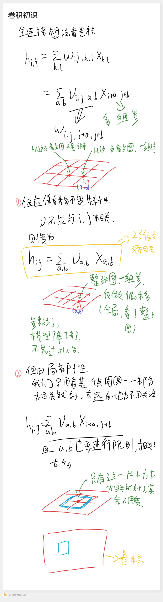

### 卷积层

#### 二维交叉相关

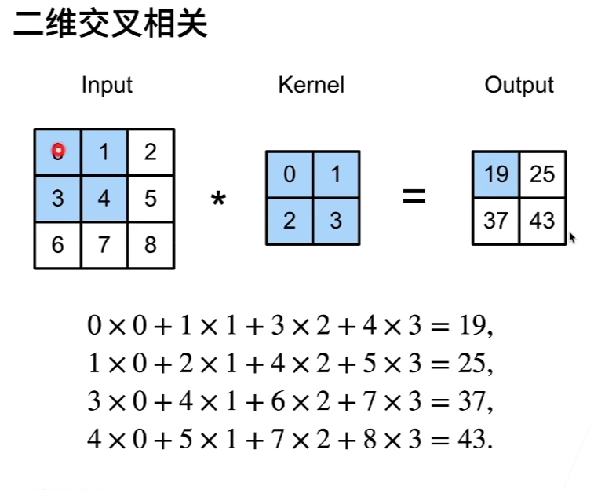

卷积过程（学过数图这个可以直接略过了）

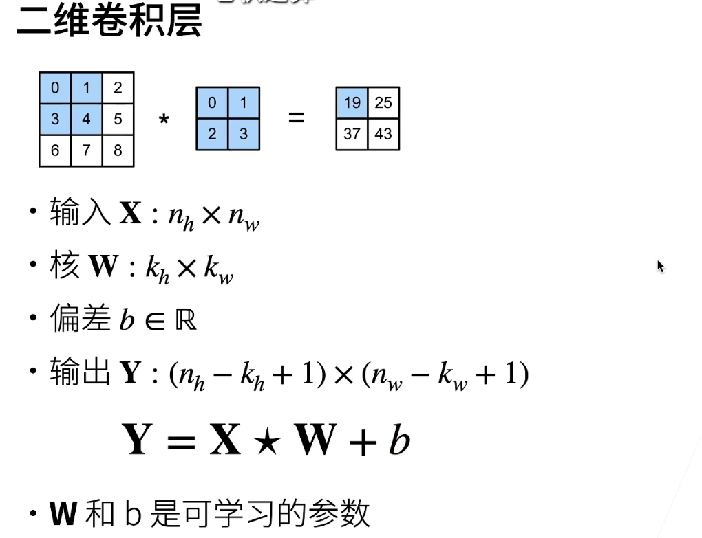

如果从辛哈哦系统来看，这其实就是一个相关运算，从$Y(大小) : (n_h - k_h + 1)\times (n_w - k_w + 1)$这个式子其实是有浓烈的信号与系统中相关的意味，其实可以看到我们的线性时不变系统，其实它是一种线性时不变系统的变体，时不变变换为了移不变，线性其实仍然是线性系统，所以后面会有激活层，用于做非线性化。

神经网络学的是核

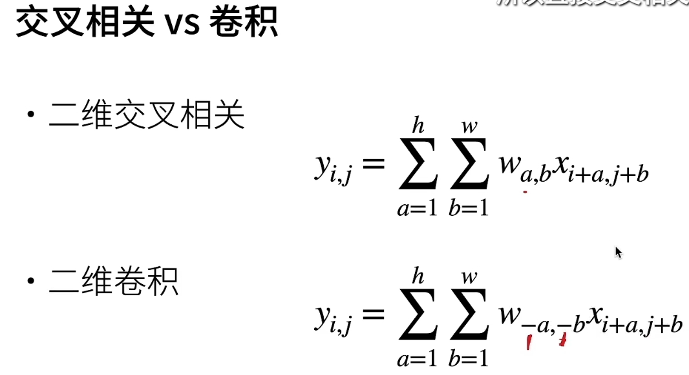

由于图像的对称性（核对称，包括图像展现出来），所以实际使用中这两者没有什么区别因此，实际实现的其实是交叉相关。

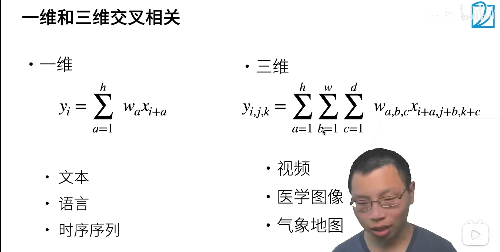

一维其实我们就可以明显的看出了时间序列的特征，当然，三维的图像子不过是把“延迟”改为了空间相关的x，y等信息。

#### 知识总结

卷积层其实可以看作是一个特殊的全连接层，就是我们将参数简化放置。

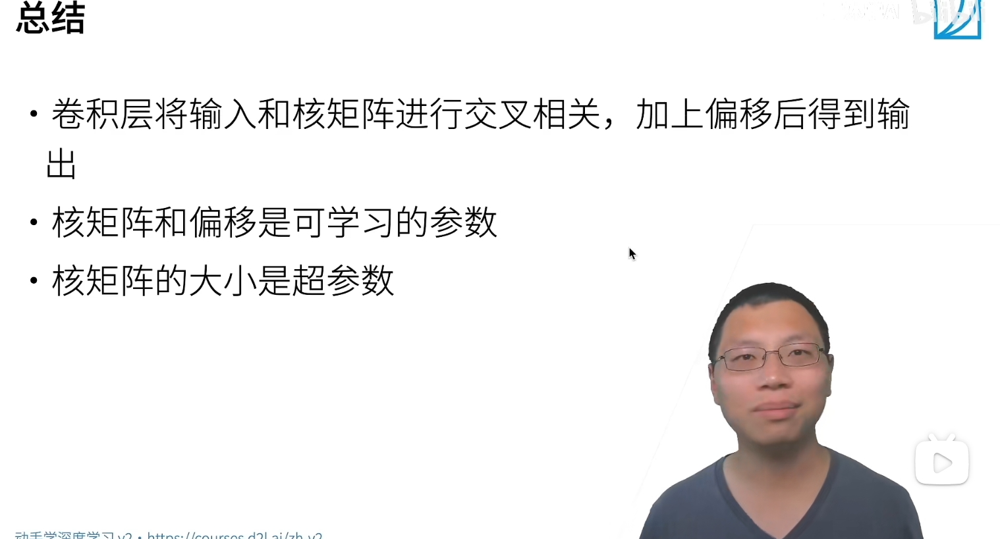

### 卷积代码实现(简单部分)

[简单的最基础的代码实现](带代码的实操笔记极其函数库解\09卷积\operater_conv_021.ipynb)

### 卷积层中的填充与步幅

#### 填充

在深度神经网络中我们可能会有一个问题，就是我们卷积其实是慢慢的将图片缩小的，那么我们使用超深的卷积层数就会导致我们的数据量大幅下降，最终出现问题(太小了没办法卷积了)

解决这个问题的最简单的方法就是我们去扩大图，扩大图最好的办法就是进行填充，将原本为空白的地方进行合理的补图与填充。

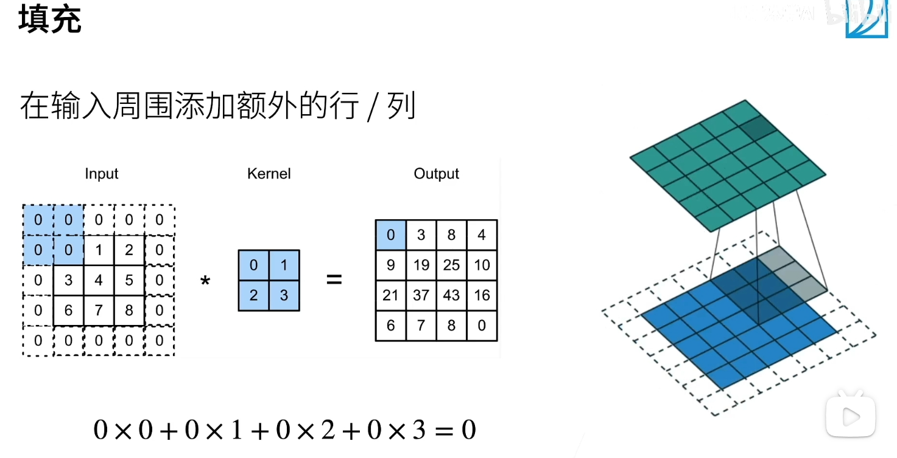

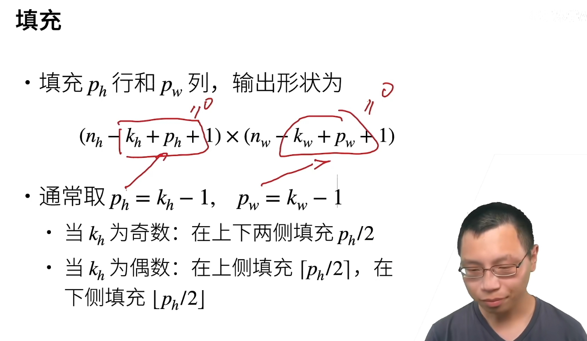

#### 步幅

其实就是在面对输入的数据的大小十分大的时候产生的问题，如果我们输入的数据量很大，其实我们是希望可以尽量减少我们的每层特征图的大小的(别看得那么细)

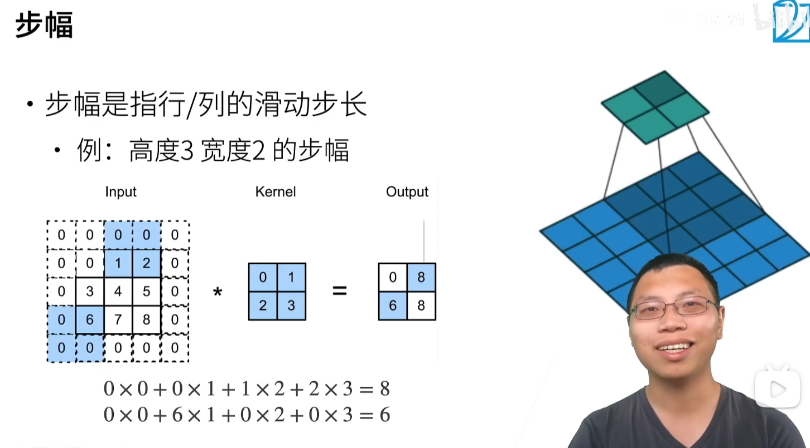

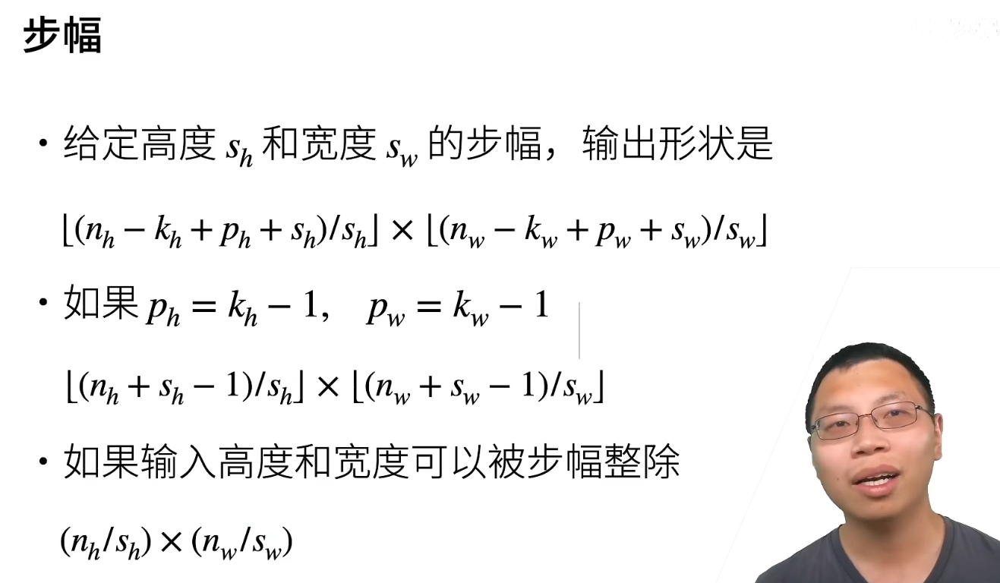

**步幅和填充都是超参数**

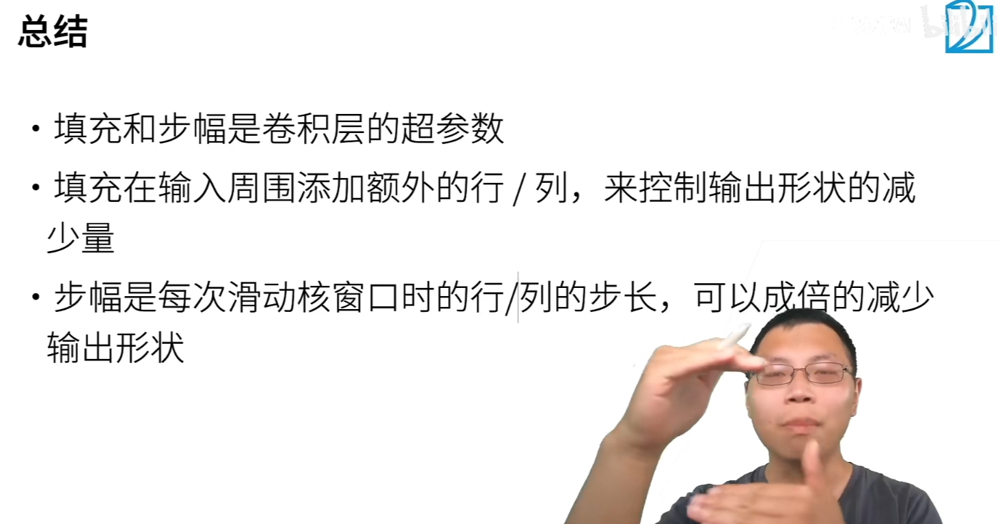

### 填充与步幅代码实现

[填充步幅和代码实现](带代码的实操笔记极其函数库解\09卷积\operator_fill_and_stride.ipynb)

### 多输入和多输出通道

#### 多个通道输入处理=>单输出

- 多个通道，每个通道都有卷积核，然后他们加和在一起

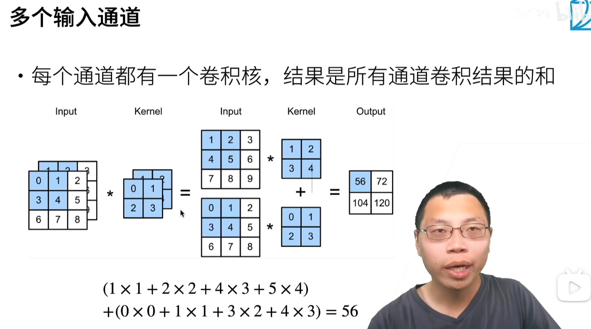

 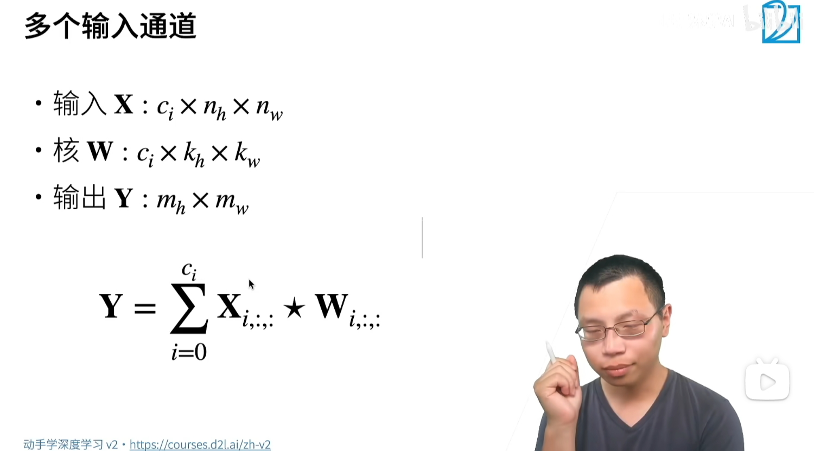

这里我们可以看到他的实现其实是我们多个核对应每张图一个核，我们每个核在每一个通道上做一次卷积，然后我们将多个通道上卷积的结果进行加和。

#### 多个输出通道

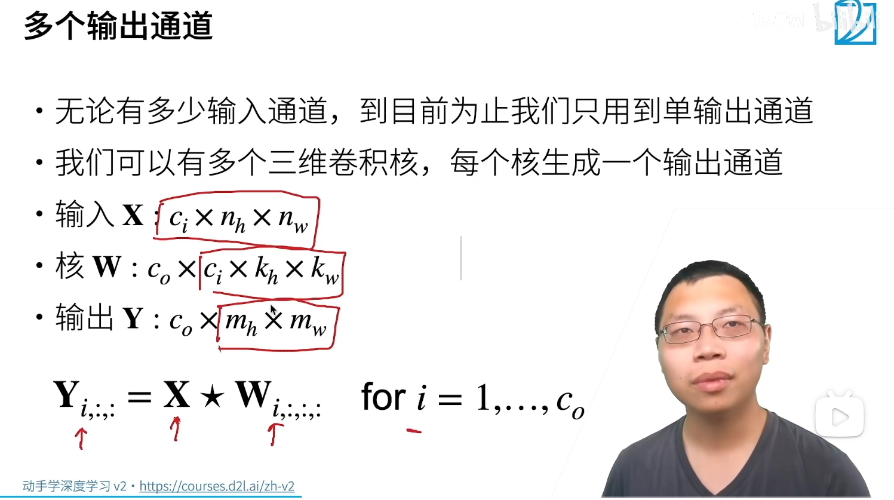

我们其实是这样理解，现在如果我们采用多输出，那么我们可以看到，相比于 多通道输入=>单通道，我们只不过是增加了层数。

理解其实是这样的，我们可以看到画红框的那一个部分，这个部分我们做的操作与之前的多输入，单输出没有什么大的区别，我们只不过是增加了这个(多输入=>单输出)这个块的“并行”层数罢了，并且这些并行的层是内核kenel值是不相同的

#### 卷积的尝试解释(多输入多输出)

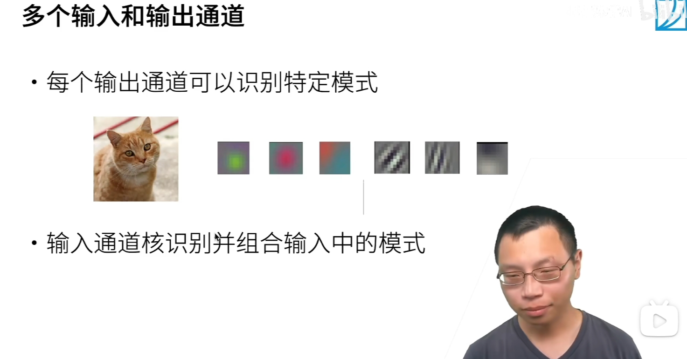

其实我们可以看到这些猫猫的不同的卷积kenel，这个其实就是我们在去识别这个猫的不同特征。当然我们是在下层的时候我们是去识别这个猫的一些的基础信息，然后越往上层是一种组合。我们多输出的意义其实在于我们每一个通道其实是做不同的事情，由于矩阵的隔离的性质，其实我们可以看到我们的多个通道其实就是在做多个分开的识别，例如有的识别猫耳朵，有的识别猫胡子……最终我们搞多通道其实就是搞多个区别不同的特征，多通道允许了我们去看多个不同的特征。多通道的意义可能在于此吧(多维度信息保留)

#### 1x1卷积核

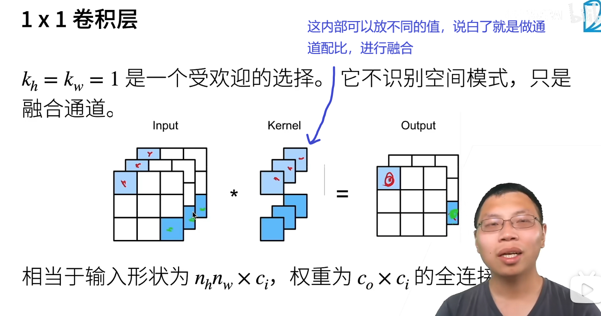

等价于拉成一个向量，做简单少参数全连接

#### 二维卷积层总结

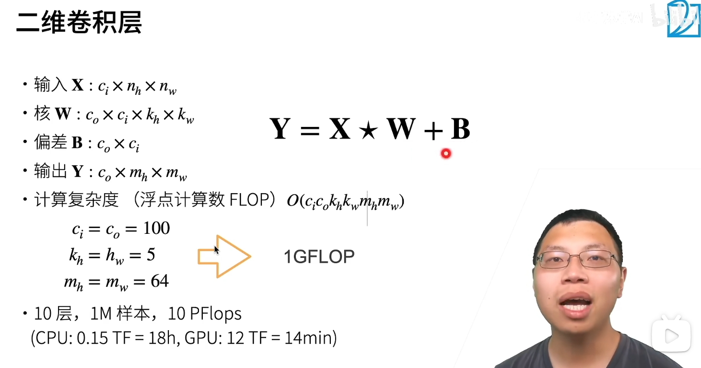

### 多输入多输出通道代码实现

[多输入多输出代码实现](带代码的实操笔记极其函数库解\10卷积\multi_input_and_multi_output.ipynb)

### 池化层

卷积对于位置是极为敏感的，我们可以看到不同的排布形式会产生截然不同的效果。

- 检测垂直边缘

  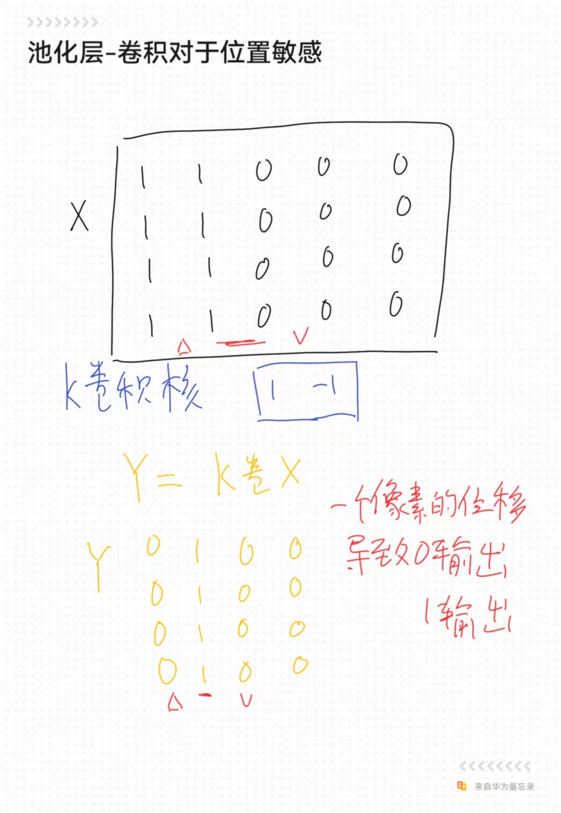

需要一定程度的平移不变性(我们有一些变化例如位置，照相因素等)我们并不希望一个模型如此的敏感(泛用性会很差)

- 照明，物体位置，比例，外观因素等因图像而异

#### 二维最大池化层

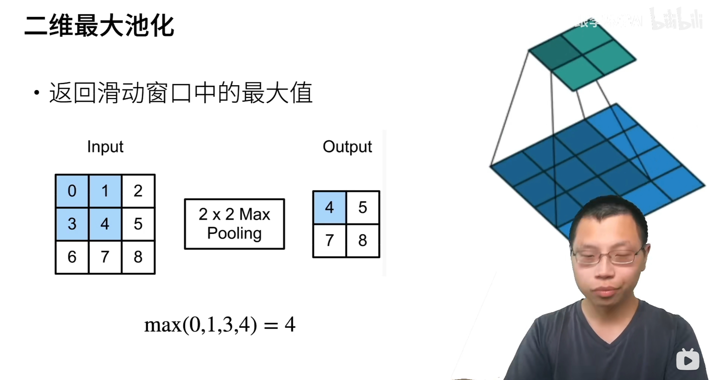

扫到窗口后去找窗口中最大的值。(并不是用核)


#### 填充，步幅和多通道

- 与卷积类似，具有填充和步幅
- 没有可学习参数(这属于一种特殊处理)
- 每个通道用池化用以可以使用的输出通道(不会做多通道融合，融合交给卷积来做)
- 输出通道=输入通道

#### 平均池化层

- 最大池化层：找每层中最强信号
- 平均池化层：做平均

  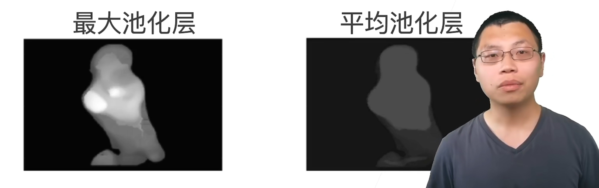

### 代码实现池化层

[池化层代码实现](带代码的实操笔记极其函数库解\10卷积\pooling.ipynb)

## LeNet

手写数字识别(最早是起源于想进行手写的邮政数字编码)，还有check(支票)识别

#### MNIST数据集

- 50000个训练数据
- 10000个测试数据集
- 图像大小28x28
- 10类

当年的big data

#### LeNet模型图解

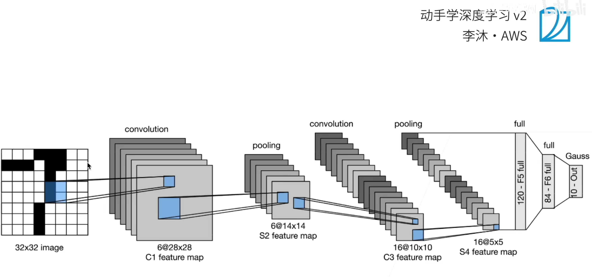

- LeNet是早期的成功的神经网络
- 先使用卷积层来学习图片空间信息
- 使用全连接层切换到类别空间

> 解析：使用卷积来进行图片特征的提取，使用pooling来降低图片的敏感度(使他们变得通用)，最后是使用全连接层来进行映射到实际的类别空间。

### LeNet代码实现

[代码实现](带代码的实操笔记极其函数库解\10卷积\LeNet.ipynb)

## AlexNet 现代机器学习热潮的先锋号

2012年左右诞生，持续引起热潮

|---------------------------------------------------|

1990年代，核函数学习占据主导，深度学习未出现

- 特征提取
- 选择核函数计算相似性
- 凸优化
- 漂亮的定理(泛函理论)

2000年几何学(图像的优化)

- 抽取特征
- 描述几何(例如多相机)【计算机视觉问题转换为几何问题】【采用解释性极好的物理模型】
- (非)凸优化
- 漂亮定理
- 如果假设满足了，效果好

在之前的地球科学，药物科学，气象科学。我们采用良好的物理模型去做，单近来(2021)我们发现深度学习做得不错。

10-15年前(2021)计算机视觉主要多是在做特诊工程

硬件于数据的关系

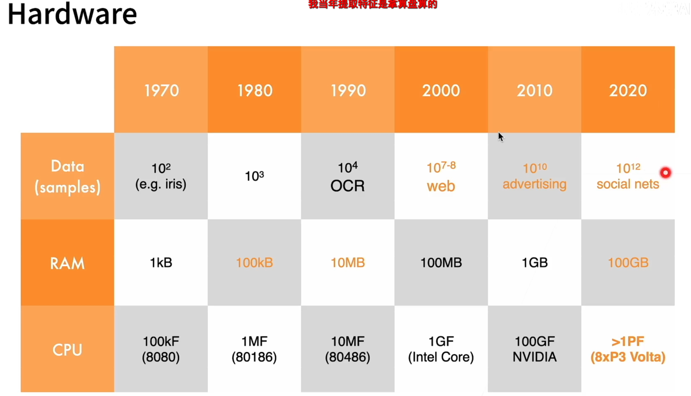

ImageNet

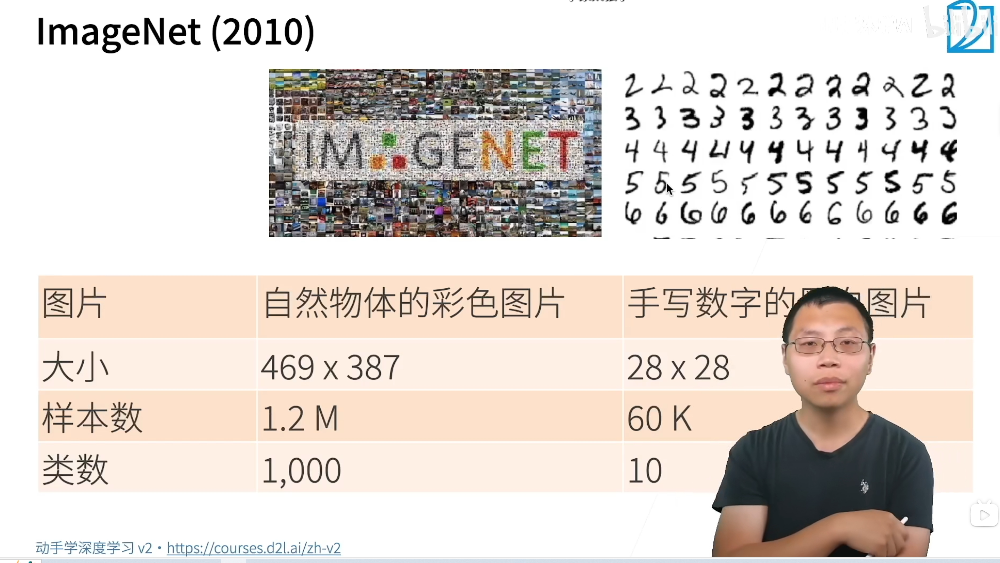

2012年获胜代码AlexNet

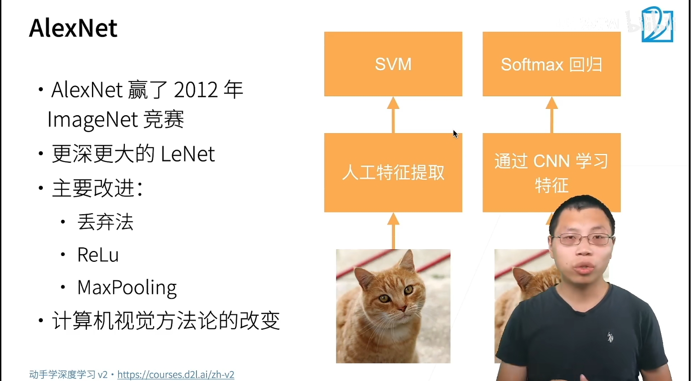

分类器与特诊提取器一起进行优化工作，最终和我们得到一个不错的结果，他们进行同时优化。最终，可以使得我们的数据进行了一致的优化，得到的结果也可能就是我们最想要的结果。深度学习最大的一个买点就是端到端！

相对于LeNet做了那些变化？

- sigmoid变为ReLU(0点梯度不崩)
- 更大的卷积，更多的隐藏全连接层，并且在之后加入了丢弃层(正则化模型)
- 数据增强(调光，旋转，切块……)

引入了更大更深的LeNet，10x参数，260x计算复杂度

引入丢弃法，ReLU，最大池化层和数据增强

### AlexNet实现

[实现代码](带代码的实操笔记极其函数库解\10卷积\AlexNet.ipynb)

## VGG使用块的神经网络

AlexNet比LeNet更深更大来得到更好的精度？

能不能更深更大？

选项(更好的更深更大)

- 更多全连接层(太贵)
- 更多卷积层
- 将卷积组合成块

### VGG块

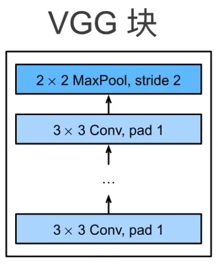

VGG块使用参数如下：

- $3 \times 3$卷积【填充为1<保原图大小> n层，m通道<输入输出通道数不变>】
- $2 \times 2$最大池化层【步幅为2】
- 可以任意填充$3 \times 3$卷积的层数

#### $3 \times 3$与$5 \times 5$卷积之争

我们的卷积大小可以看成是$3 \times 3$与$5 \times 5$两种不同大小的卷积选择，我们可以看到$5 \times 5$相比于$3 \times 3$卷积有更大的可视范围，但是随之带来的是更大的开销(层数可能做不多)，VGG的提出者门对于不同大小的卷积与层数在**相同的资源条件下**做了比较。发现相比于少一些层数的$5 \times 5$卷积核，更多层数的$3 \times 3$卷积核更具优势！

#### 性能展示

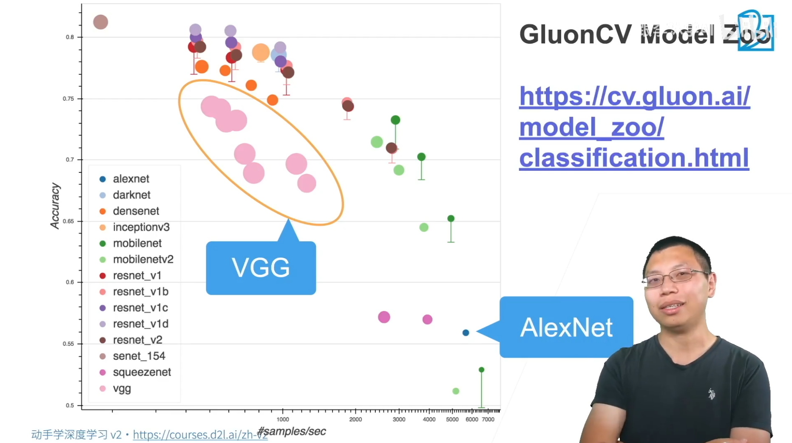

其中圆点越大代表越占用内存

#### VGG影响

VGG的块思想影响了后来的关于圣经网络的设计，对于块的配置和相关的这种乐高搭积木的方法影响深远。

### VGG实现

[代码实现](带代码的实操笔记极其函数库解\10卷积\VGG.ipynb)

## 网络中的网络（NiN）Network in Network

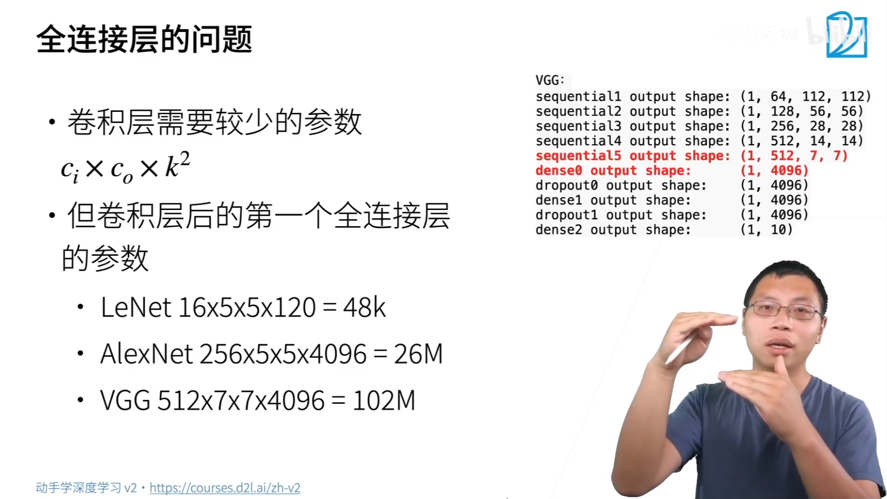

很大的全连接层会占用很大的带宽和很多的内存，这是一个"很贵"的计算操作。并且很容易过拟合(过拟合其实就是我们的模型的参数量其实高于数据量的时候我们的模型就会产生"应试"反应。)

相比于之前有人说使用了MLP实现了卷积的功能，那么NIN其实就是使用卷积实现了全连接层的功能。

### NiN块

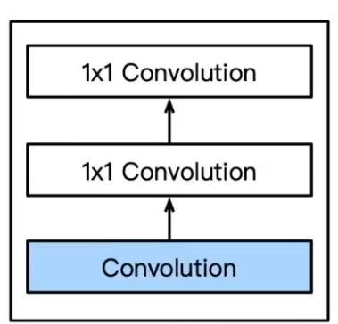

如图，蓝色的Convolution块是我们的卷积层，而剩下两次的$1 \times 1$Convolution是当作全连接层来使用的。

- 一个卷积后面跟了两个$1 \times 1$卷积
  - 步幅1，无填充，输入输出形状一致
  - 起到全连接的作用

### NiN架构

- 无全连接层
- 交替使用NiN块和步幅为2的最大池化层
  - 以此来逐步减少图的宽和高，并增加通道数
- 最后使用全局平均池化层得到输出
  - 其输入的通道数是类别数【注解：意思是此时我们得到的通道的个数(卷积+池化涨通道，减少图片的高和宽)，并且此时的平均池化的核大小是现在这张图的大小->出来也是一个数值】

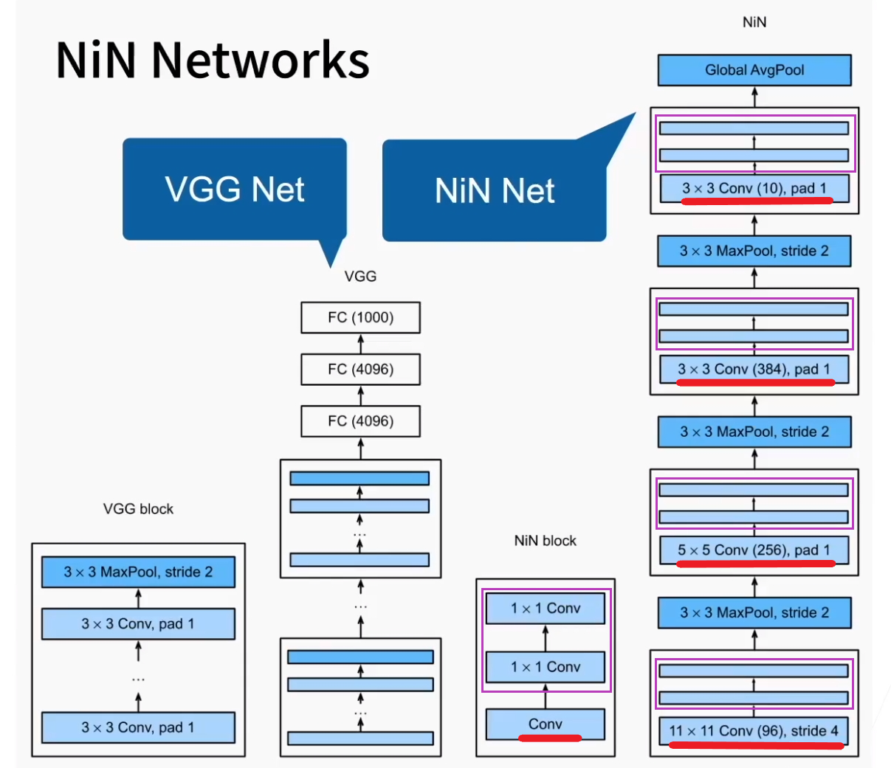

### 总结

- NiN块使用卷积层增加两个$1\times 1$卷积层

  - 后者对于每个像素增加了非线性性【加入的两个$1 \times 1$是用于增加其非线性性】
- NiN使用**全局平均池化层**来替代VGG和AlexNet中那些令人感到巨大的全连接层【平均池化，不用学参数】

  - 这样做无疑减少了参数个数，不容易过拟合！
  - 其中的MaxPoling，Global Pooling降低了全局复杂度，提升了模型泛化性但是降低了收敛速度。

### NiN网络代码实现

[代码实现](带代码的实操笔记极其函数库解\10卷积\NiN.ipynb)

## GeogLeNet【含并行连结的网络】

群雄争霸ImageNet分类比赛

出现一个问题：最好的卷积层超参数如何确定？

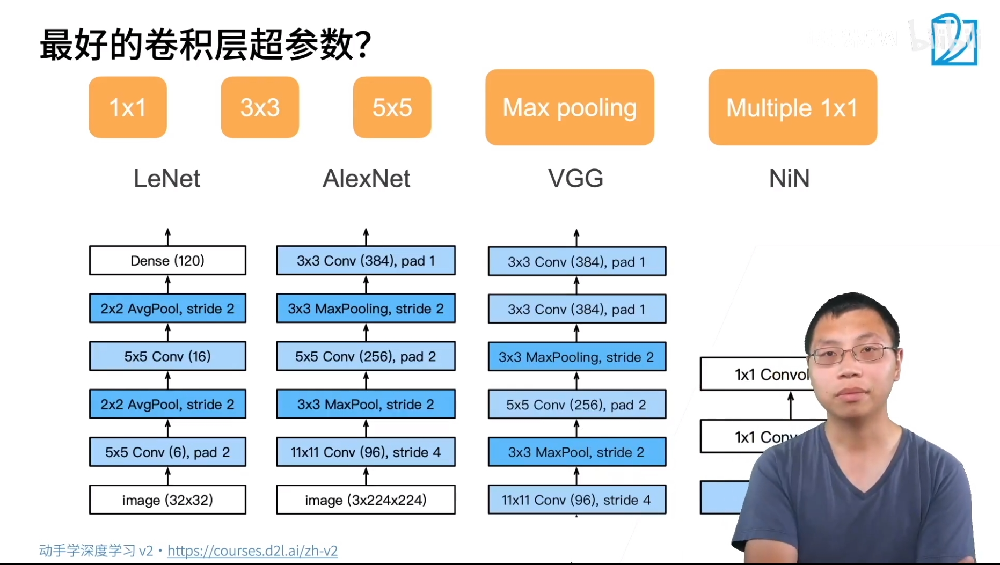

### Inception块：小学生才做选择，我全都要

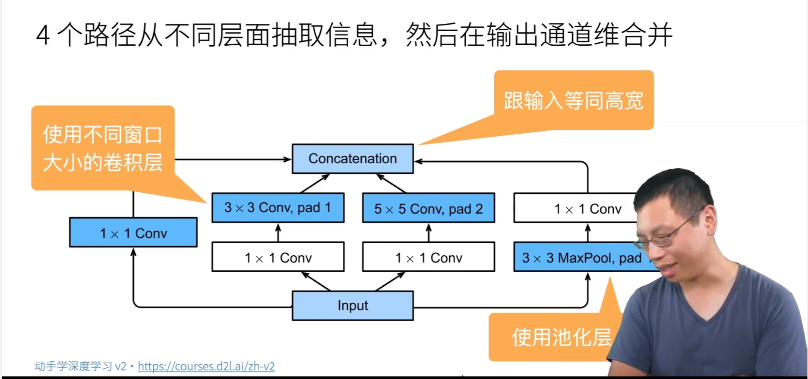

走四路不同的处理，在不改变图大小的情况下。使用多通道来合成一个新的数据元。

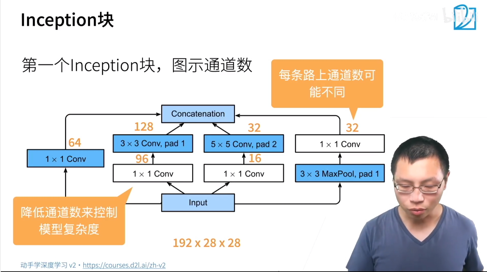

其中白色的方块主要是用于获取通道信息的，而蓝色的主要是用于抽取信息的。

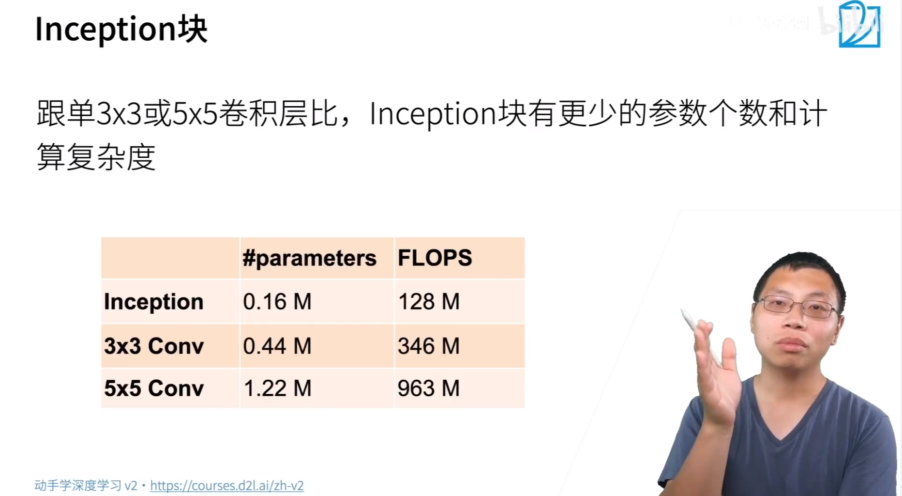

通过使用$1 \times 1$的卷积来大量减少了参数数量

### GeogLeNet框架

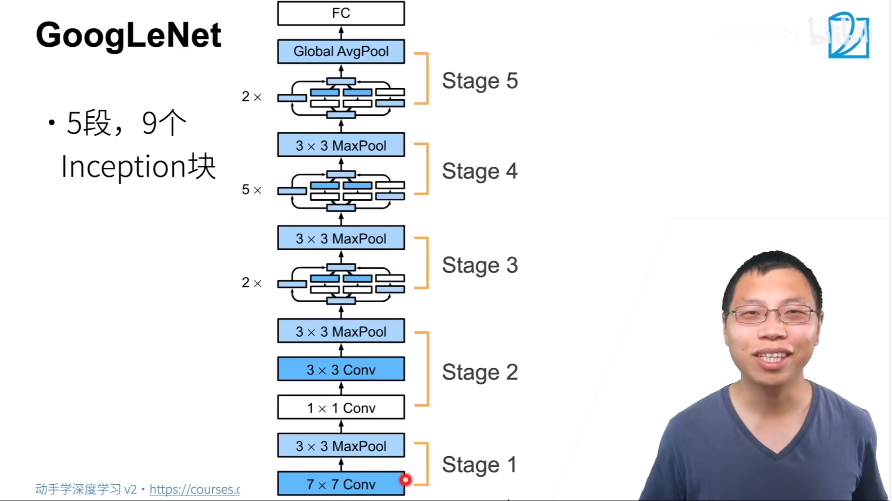

> 注：高宽减半是一个stage

这里使用了和NiN一样的使用卷积代替全连接的想法，使用了大量的卷积块进行相关的操作，这是一个和NiN一样想法的点，另外一个点就是他没有像NiN一样直接使用与分类类别等大小的Global AvgPool通道数。是Pooling之后我再通过全连接层接触到对应类别点！更为灵活

#### 分段分析

##### 1&2段

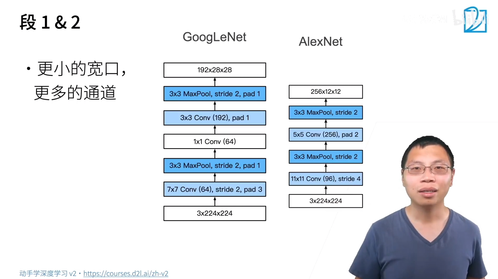

相比于AlexNet，GeogLeNet对于数据的处理更为细致，花费了更多的卷积块来对于数据的高宽进行大幅缩减，但是二者的想法都是一致的，快速的减少高宽，增加通道数使得我们的后处理变得更为灵活！数据的信息更为精简，数据量与网络匹配！

##### 3段

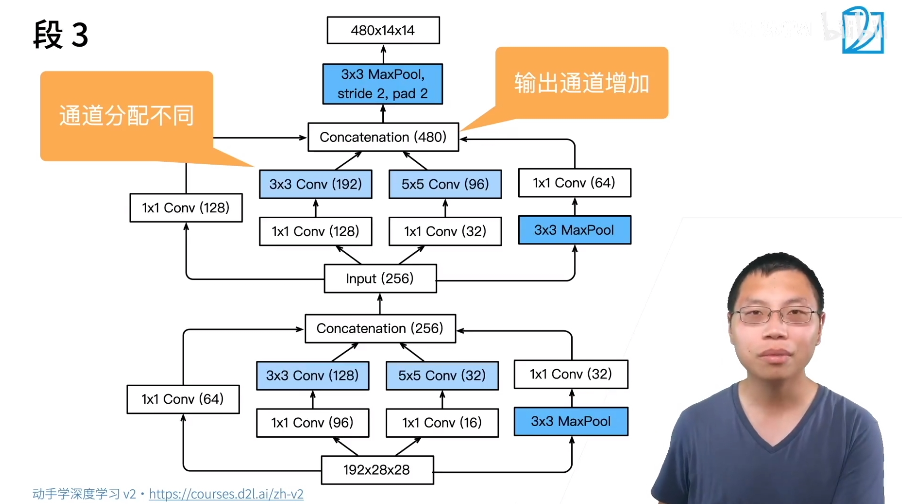

暴涨的通道数和变小的特征图

##### 4&5段

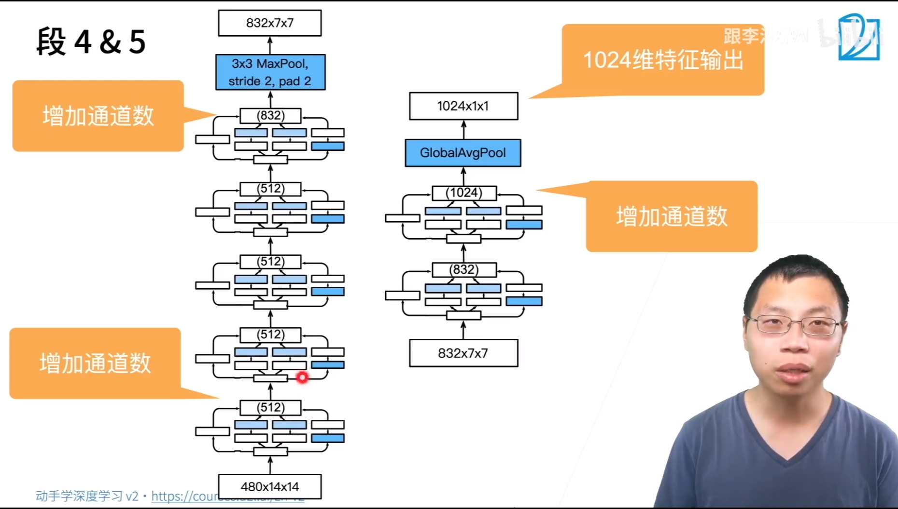

由于参数特别多，很难复现

#### Inception有后续各种各样的变种

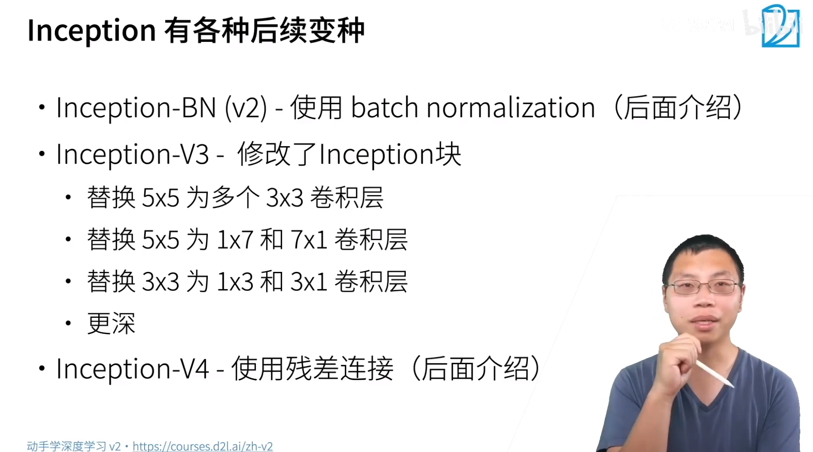

##### Inception V1与V3对比

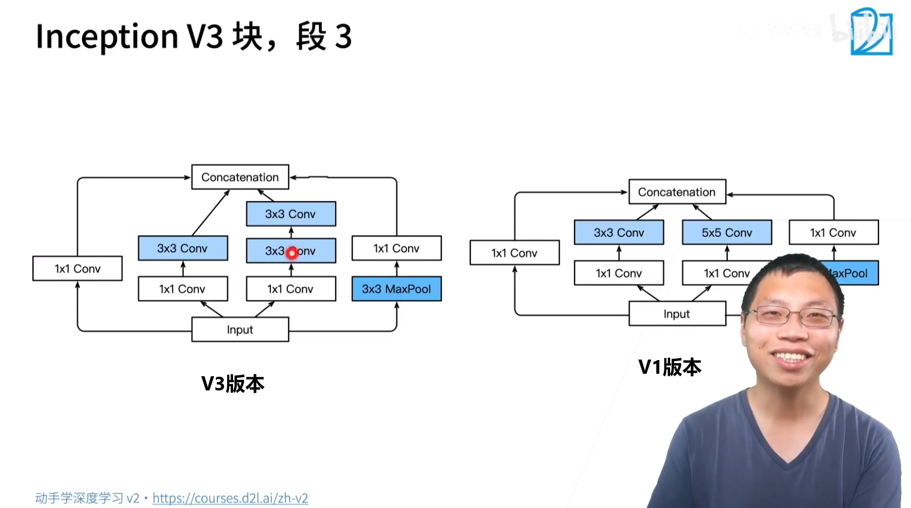

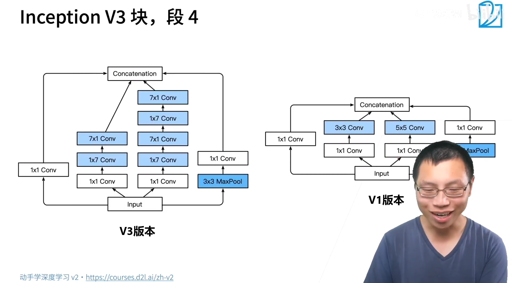

##### 性能比较图

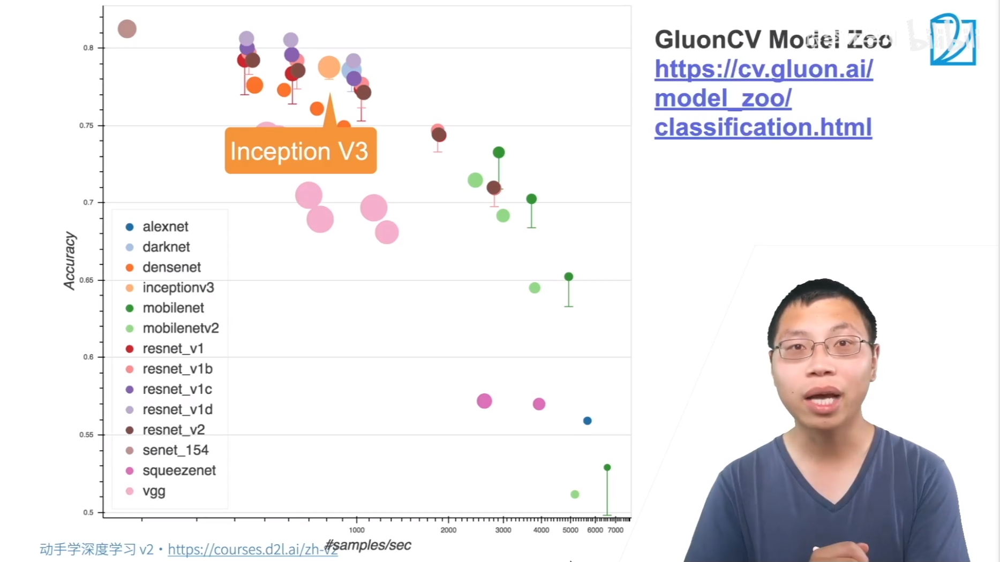

### 总结

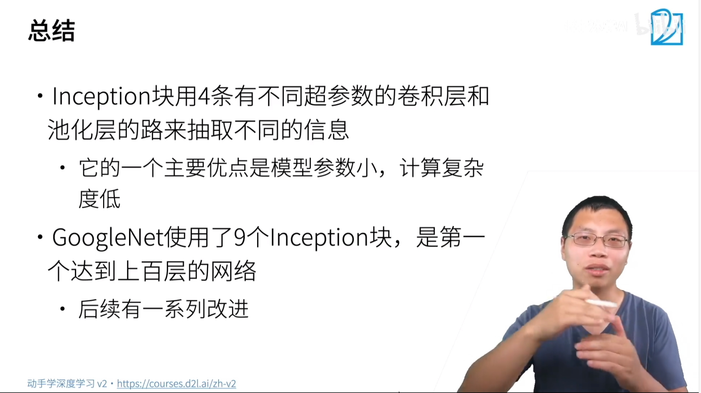

### 代码实现

[代码实现](带代码的实操笔记极其函数库解\10卷积\googlenet.ipynb)

## 批量归一化
