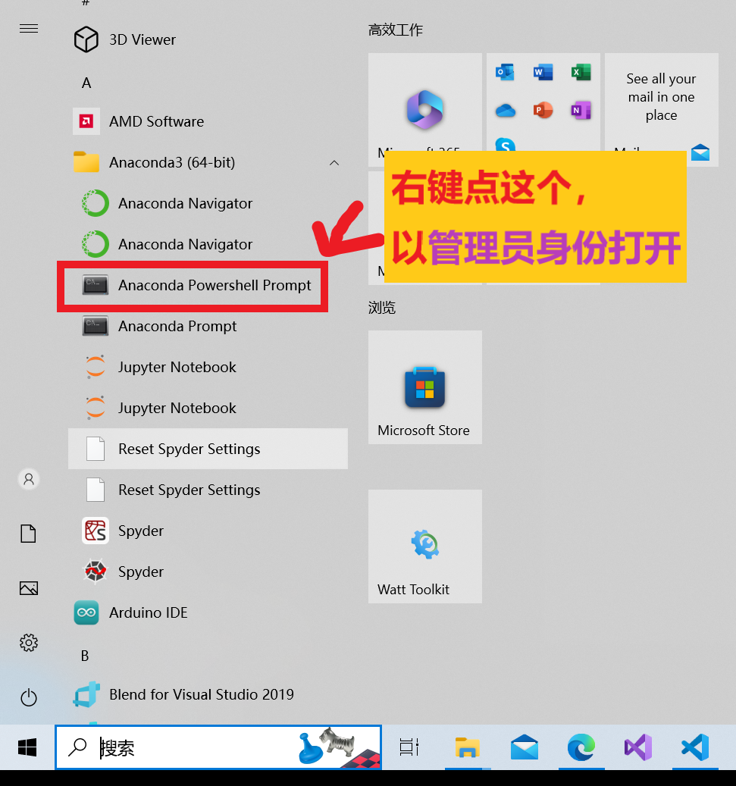

# 跟着李沐学AI

## 安装

注意，我们在这里安装只是需要一些简单的操作就好了，其实对于环境来说，我们使用windows或者是linux都是可以的，当然更推荐直接采用Linux，如果想要在Linux上玩GPU的话建议在服务器上操作！

### windows

我建议的是安装一个anaconda，直接去官网上安装，找新版，新版会做多引用和库间管理（类似于跨模块优化），安装见

[【精选】Anaconda超详细安装教程（Windows环境下）_conda安装-CSDN博客](https://blog.csdn.net/fan18317517352/article/details/123035625)

接着你就可以在anaconda的快速环境部署中畅游了！（你可以选择装非C盘，但这样会增加出错的风险，可以自行考虑）

> **注意！新版本的anaconda可能会有我们在使用Navigate的时候无法启动的问题，这里其实就是直接右键管理员模式运行就解决了**

接下来就是正菜了，使用anaconda。召出开始菜单



接着就在出现的黑窗口中输入：

```
conda create -n d2l-zh python=3.8
```

创建环境(注意其中的”**d2l-zh**“是你创建的环境名，是由在create后面的-n所赋予的，这个名字随意)

接着会出现询问，直接输入y

然后会自动开始创建环境

之后我们激活环境，还是在这个黑窗口中输入：

```
conda activate d2l-zh
```

接着我们会看到我们的输入命令的前缀由base变成了(d2l-zh)表明我们切换到了这个环境！

接着我们执行

```
pip install jupyter d2l
```

**注意！要与B站李沐老师视频中的直接写全会导致你会去安装出最新一版的pytorch可能会导致你无法安装gpu版本！（最新pytorch支持CUDA12.0系列我的CUDA11.7不支持力）**


接下来你就可以访问pytorch官网

[Previous PyTorch Versions | PyTorch](https://pytorch.org/get-started/previous-versions/)

从之前的版本中找到自己适合的，我自己选择的是1.13.1


然后就可以根据复制的信息直接在之前的黑窗口中粘贴安装对应版本

> **注意！你们一定要装CUDA，如果对于GPU pytorch安装不熟的移步**
>
> [Pytorch(GPU版)安装 - 知乎 (zhihu.com)](https://zhuanlan.zhihu.com/p/479848495)

然后你就装好他们了，验证一下


这样你环境就算配好了

接下来去下载d2l-zh和下载d2l-pytorch-sliders的方法视频中讲得很好，建议d2l-pytorch-sliders直接用GitHub Desktop下

### Linux

前面的anaconda换成安装miniconda就好了，或者你安装anaconda Linux版也可，但我觉得miniconda在linux上更适合，其余操作不变，就是如果你开服务器的话用wget下d2l-zh和git安装一下然后下d2l-pytorch-sliders
