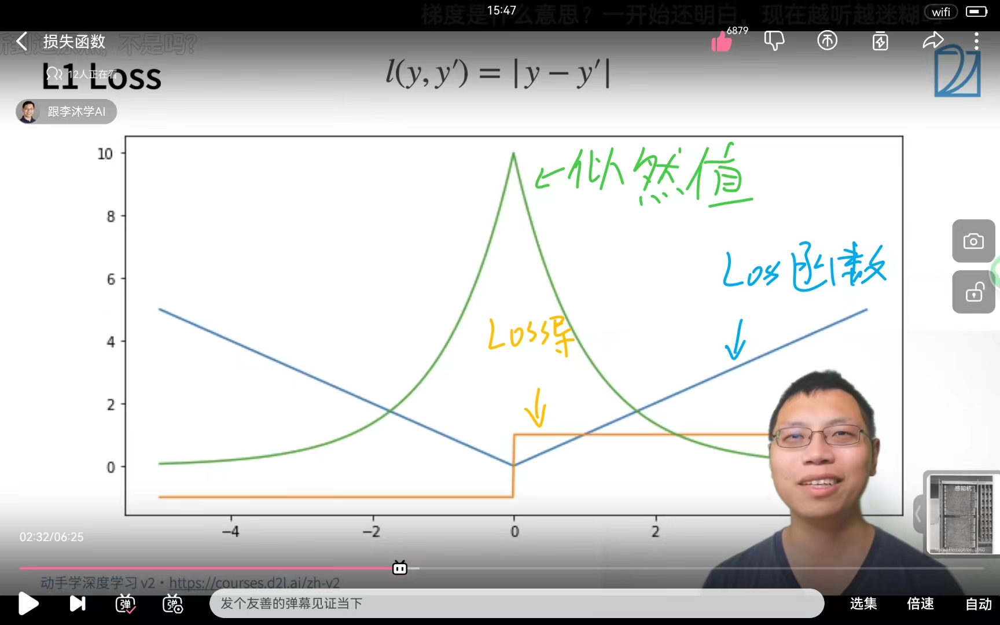

# 跟着李沐学AI

## 安装

注意，我们在这里安装只是需要一些简单的操作就好了，其实对于环境来说，我们使用windows或者是linux都是可以的，当然更推荐直接采用Linux，如果想要在Linux上玩GPU的话建议在服务器上操作！

### windows

我建议的是安装一个anaconda，直接去官网上安装，找新版，新版会做多引用和库间管理（类似于跨模块优化），安装见

[【精选】Anaconda超详细安装教程（Windows环境下）_conda安装-CSDN博客](https://blog.csdn.net/fan18317517352/article/details/123035625)

接着你就可以在anaconda的快速环境部署中畅游了！（你可以选择装非C盘，但这样会增加出错的风险，可以自行考虑）

> **注意！新版本的anaconda可能会有我们在使用Navigate的时候无法启动的问题，这里其实就是直接右键管理员模式运行就解决了**

接下来就是正菜了，使用anaconda。召出开始菜单


接着就在出现的黑窗口中输入：

```
conda create -n d2l-zh python=3.8
```

创建环境(注意其中的”**d2l-zh**“是你创建的环境名，是由在create后面的-n所赋予的，这个名字随意)

接着会出现询问，直接输入y

然后会自动开始创建环境

之后我们激活环境，还是在这个黑窗口中输入：

```
conda activate d2l-zh
```

接着我们会看到我们的输入命令的前缀由base变成了(d2l-zh)表明我们切换到了这个环境！

接着我们执行

```
pip install jupyter d2l
```

**注意！要与B站李沐老师视频中的直接写全会导致你会去安装出最新一版的pytorch可能会导致你无法安装gpu版本！（最新pytorch支持CUDA12.0系列我的CUDA11.7不支持力）**


接下来你就可以访问pytorch官网

[Previous PyTorch Versions | PyTorch](https://pytorch.org/get-started/previous-versions/)

从之前的版本中找到自己适合的，我自己选择的是1.13.1


然后就可以根据复制的信息直接在之前的黑窗口中粘贴安装对应版本

> **注意！你们一定要装CUDA，如果对于GPU pytorch安装不熟的移步**
>
> [Pytorch(GPU版)安装 - 知乎 (zhihu.com)](https://zhuanlan.zhihu.com/p/479848495)

然后你就装好他们了，验证一下


这样你环境就算配好了

接下来去下载d2l-zh和下载d2l-pytorch-sliders的方法视频中讲得很好，建议d2l-pytorch-sliders直接用GitHub Desktop下

### Linux

前面的anaconda换成安装miniconda就好了，或者你安装anaconda Linux版也可，但我觉得miniconda在linux上更适合，其余操作不变，就是如果你开服务器的话用wget下d2l-zh和git安装一下然后下d2l-pytorch-sliders

## N维数组

N维数组是机器学习神经网络的基础，也是主要数据结构

### 分类

#### 0-d（标量）

就是一个数字


在许多分类问题中他被当作是一种类别的特征，其实分类问题没那么玄乎，其实就是在分布图上画一条线，然后我们可以判断现在的这个值是在线的哪个部分然后我们就可以及逆行判断了

> e.g
>
> 我们判断任意的一个数字是否是一个负数？
>
> x>0正数 x<0负数
>
> 其实这就是原理，这既是一种最为简单的分类

#### 1-d（向量）

这是一个特征值（在机器学习中这样认为！）

其实就是我们在进行表述一个东西的时候我们如何去看待他们（就像我看到一个苹果，但是机器并不会遮掩更直接做出这种语言直接表述，那么他们其实是通过多个不同的特征来理解的【红色的】【有一定形状的】【口感脆脆甜甜的】【闻起来有特殊香气的】……那么人也是这样进行认知的，所以向量就是将我们人的认知的**某一项**归类抽象成为一组数字<为什么要高一组数字捏，直接一个值不好i吗，那当然可能会有问题，就像人判断一个味道是从酸，甜，苦，辣，咸多种味觉入手最终描绘出一个味道，其实这些向量上不同的值就对应于不同的特点，**而且向量多维度描述利于拓展**>，这就是特征向量的由来！）


#### 2-d（矩阵）

一个样本（由多个特征值组成）


其实这既是描述一个事物（样本了），我们可以由我前面的论述体现到，多特征向量合起来其实就是一个完整样本的表述力！！！（例如视觉+听觉+嗅觉+触觉……人们就可以描述出一个东西啦）

#### 3-d和4-d和5-d

这个其实就是分得更细了，其实就是相关联的东西变多了，表述同一个东西的描述空间更为宽广

> e.g
>
> RGB图片
>
> 其实就是说我们色觉正常的人是通过三原色判断各种颜色的，那么表述丰富了，看到的信息变多力！
>
> 如果我们看到的只是一个2-d矩阵（黑白图片）那我们看到的信息就更少了


#### n-d

其实d就是维度，一种表现相关数据的数据结构罢了，为多越多越丰富详实

例如：你听到这个人的名字，那么这是一个2-d的东西，你不太知道他，假如你看到他的图片（彩色）那就是3-d感知了，如果你看到他走过来那就是4-d动态感知也有了，你闻闻他，那就是5-d力，和他交流那知道的东西的维度多多得数不清了，那就是n-d啰。

**注意！d维度的分解是：要不相关的东西才能分成一个新维度哦，类似于数学上的要正交，要画x-y平面，x，y完全不相关，一个变化与另一个无关才好！**

### 创建数组

#### 形状

要给出一个具体形状（1x2或3x4或5x6x7……）

#### 要给出元素数据类型

这个是方便计算机做存储的（int float ）[整数，浮点数，定点小数……]

#### 元素的值

给出你给的元素的值

### 访问数组


李沐老师给出的表述法是基于python的，不同语言表述方式不一样哦

## 数据操作+数据预处理

### pytorch实操-数据操作

#### pytorch语法

首先先导入

```python
import torch as tor
```

生成一个数组

```python
import torch as tor #import就是导入，as是给torch取别名，之后tor就等于是torch库
x = tor.arange(12)  #arange(n)是生成一个从0到n-1的数组，例如n = 12，则生成的数组是0-11
x                   #用于显示
x.shape             #输出张量的形状
x.numel()           #输出数据的总数（永远是标量）
x.reshape(3,4)      #修改张量的形状而不改变元素的数量和元素值reshape(n,m,……)是将张量改成nxmx……的张量
x2 = tor.tensor([[[x11,y11,z11],[x21,y21,z21]],[[x12,y12,z12],[x22,y22,z22]]]) #套娃造变量
```

自己编程程序见[实操笔记](带代码的实操笔记极其函数库解\00数据操作和预处理\lib_know_data_operator.ipynb "这是一个实操笔记")

> 小贴士
>
> * 注意我们在编写函数时，这个类中最后一个成员函数的使用才是输出，例如：***x.tensor(……).shape***注意shape值才是输出哦
> * 注意我们在写tensor构建张量时，我们可以在元素中加入1.0等这种带有明显虚数意义的值可以使得整个tensor就会被认定为是浮点数^_^

### pytorch实操-数据预处理

数据预处理其实就是把我们非数值的数据变为数值型数据。这里我们主要使用的是pandas这个库。

具体实操看[实操笔记](带代码的实操笔记极其函数库解\00数据操作和预处理\lib_know_data_preprocessing.ipynb "这是一个实操笔记")

### 注意事项

见[实操笔记](带代码的实操笔记极其函数库解\00数据操作和预处理\lib_know_data_operator_preprocessing_tips.ipynb "这是一个实操笔记")

## 线性代数

线性代数是一个数学的基础，其实这里不会涉及过多的线性代数

### 标量

#### 简单操作

- $c = a + b$
- $ c =  a * b$
- $c = \sin\theta$

#### 长度

$$
|a|= \begin{cases}a&\text{a>0}\\-a&\text{other}\end{cases}
$$

$$
|a + b| \leqslant |a| + |b|
$$

$$
|a * b| = |a| * |b|
$$

### 向量

#### 简单操作

- $\vec{c} = \vec{a} + \vec{b} \quad where \quad c_i = a_i + b_i$
- $\vec{c} = k_{标量} \bullet \vec{b} \quad where \quad c_i = k_{标量} * b_i $
- $\vec{c} = \sin \vec{a} \quad where \quad c_i = \sin a_i$

#### 长度

$$
||\vec{a}||_2 = [\sum^{m}_{i = 1}a^2_i]^{\frac{1}{2}}
$$

$$
||\vec{a}|| \geqslant 0 \quad for \quad all \quad \vec{a}
$$

$$
||\vec{a} + \vec{b}|| \leqslant ||\vec{a}|| + ||\vec{b}||
$$

$$
||\vec{a} \bullet \vec{b}|| = |\vec{a}| \bullet ||\vec{b}||
$$


- 向量点乘$\vec{a^T} \times \vec{b} = \sum^{n}_{i}a_i*b_i$
- 正交判定$\vec{a^T} \times \vec{b} = 0$


### 矩阵

#### 简单操作

- $C = A + B \quad where \quad C_{ij} = A_{ij} + B_{ij}$
- $C = k_标量 \bullet B \quad where \quad C_{ij} = k_标量 * B_{ij} $
- $C = \sin A \quad where \quad C_{ij} = \sin A_{ij} $

#### 乘法

$$
\vec{c} = A \bullet \vec{b} \quad where \quad c_i = \sum_jA_{ij} * b_j
$$


$$
C = A \bullet B \quad where \quad C_{ik} = \sum_jA_{ij} * B_{ik}
$$


#### 范数

$$
\vec{c} = A \bullet \vec{b} \quad hence \quad ||\vec{c} \leqslant ||A|| \bullet ||\vec{b}||
$$

取决于如何衡量b和c的长度

##### 常见范数

- 矩阵范数：最小满足上述公式的值
- Frobenius范数
  $$
  ||A||_{Frob} = [\sum_{ij}A^2_{ij}]^{\frac{1}{2}}
  $$

#### 对称与反对称

$$
A_{ij} = A_{ji} 对称矩阵
$$

$$
A_{ij} = - A_{ji}反对称
$$

#### **正定**！！！！

$$
||x||^2 = x^T \bullet x \geqslant 0 \quad 推论得出 \quad x^T \bullet A \bullet x \geqslant 0
$$

#### 特殊矩阵

##### 正交矩阵

- 所有行都相互正交
- 所有行都有单位长度$U \quad wth \quad \sum_jU_{ij}*U_{kj} = \delta_{ik}$
- 可以写为$UU^T = 1$

##### 置换矩阵

$$
P \quad where \quad P_{ij} = 1 \quad if \space and \space only \space if \quad j = \pi(i)
$$

- 置换矩阵是正交矩阵

#### 特征向量和特征值


### 线性代数代码实现

代码实时操作(上课跟着做)见[operator](带代码的实操笔记极其函数库解\01线性代数\opreator_linear_algbra.ipynb "操作实时版本")

库操作解析(总结分析)见[Lib库解](带代码的实操笔记极其函数库解\01线性代数\lib_know_linear_algebra_make_true.ipynb "库解")

## 矩阵计算

### 求导数

#### 常见导数

|       $y$       | $a$ | $x^n$      | $e^x$ |    $ln(x)$    | $\sin(x)$ |
| :---------------: | ----- | ------------ | ------- | :-------------: | ----------- |
| $\frac{dy}{dx}$ | 0     | $nx^{n-1}$ | $e^x$ | $\frac{1}{x}$ | $\cos(x)$ |

tips: $a$不是$x$的函数

#### 多函数求导公式

求导公式:

| $y$             | $u + v$                         | $uv$                              |     $y = f(u),u = g(x)$     |
| ----------------- | --------------------------------- | ----------------------------------- | :----------------------------: |
| $\frac{dy}{dx}$ | $\frac{du}{dx} + \frac{dv}{dx}$ | $\frac{du}{dx}v + \frac{dv}{dx}u$ | $\frac{dy}{du}\frac{du}{dx}$ |

#### 亚导数(偏导数)$\partial$

- 发现导数不可微!


采用分段偏导的方法

$$
\frac{\partial {| x |}}{\partial{x}} = \begin{cases}
 1,\,\,\,x>0\\
 a,\,\,\,x = 0,\quad a \in [-1,1]\\
 -1,\,\,x<0\\
 \end{cases}
$$

- 另一个例子

$max(x,0)$函数

$$
\frac{\partial max(x,0)}{\partial x} = \begin{cases}
1,\,\,\,x > 0\\
a,\,\,\,x = 0,\quad a \in [0,1]\\
0,\,\,\,x < 0
\end{cases}
$$

### 向量求导


其实就是很简单的一个问题，我们可以发现！其实 $x_n$ 就是一个个维度，偏导其实可以理解为同纬度计算，非同纬度其实就是常熟，同纬度其实就是可以进行正常求导的玩意。

## 自动求导

### 链式法则

推荐李宏毅的视频。

#### 求导方法二则

##### 公式法

利用公式进行各种个样的操作

##### 数值法

其实就是将变量进行做差，求导项趋于0

#### 计算图


### 两种模式


> 例子
>
> 

反向算法总结(建议这一部分看李宏毅老师的课程)


我们其实可以在这里发现一个有趣的现象

- 我们的数据使用时，我们的顺向其实时一个符号计算，那么前因后果都要知道
- 反向计算其实是一个数值计算，啊u哦一我们就可以直接去存前面的数值就好了，不需要去将整个付哈哦体系都搞一遍

### 自动求导实现

详情见[实操笔记](带代码的实操笔记极其函数库解\02自动求导\lib_know_autograd.ipynb "实操笔记")

## 线性回归

### 引入：买房子


### 最优化方法

#### 梯度下降


我们其实就可以用一个公式来解决这问题

$$
w_t = w_{t - 1} - \eta*\frac{\partial loss}{\partial w_{t-1}}
$$

其中 $\eta$ 是一个**超参数(hyper parameter)**

超参数其实就是我们需要自己调整的参数，这个不是由机器学习可以优化得来的参数，这个$\eta$参数被乘称作学习率，用于表示迭代的幅度(直观体现就是快慢)

##### 梯度下降策略

对于学习率这个超参数的调整


对于如果我们要计算一个训练集上的上的loss，其实我们会因为要计算的数据过多就会导致我们的训练时间太长

> 例如一个集有1000_000_000个数据，首先我们要算出loss其实就是我们要将数据在模型中跑一遍获得一个值，这个值与正确值做比对得到loss，那么如果整个就要跑1000_000_000次！
>
> 于是未来使得我们的速度变快，我们就其实是采用分块的方式进行，这样我们可以进行一定程度的并行，这样我们可以在一个时间内做出更多的事。并且我们对于原始数据分批次训(就是缩小一次迭代所i需要计算的数据量)
>
> 
>
> 

梯度下降其实就是沿着反梯度的方向进行更新求解就好了。

### 线性回归算法从零实现

从零实现整个方法(带库的)

- 数据流水线
- 模型
- 损失函数
- 小批量随机梯度下降优化器

详见

[库解](带代码的实操笔记极其函数库解\03线性回归\lib_know_linear_regression-scartch.ipynb)

[实操笔记](带代码的实操笔记极其函数库解\03线性回归\operator_linear_regression-scartch.ipynb)

### 线性回归算法简洁实现

其实就是调用了一些库，会更快更简单，程序可读性更高

[库解](带代码的实操笔记极其函数库解\03线性回归\lib_know_linear_regression-easy.ipynb)

[实操笔记](带代码的实操笔记极其函数库解\03线性回归\operator_linear_regression-easy.ipynb)

## Softmax回归

这其实是做为一种分类模型去看的，是一种分类器

### 回归vs分类

- 回归是去预测一个未来的值
- 分类其实是去做一个函数然后依据我们的点在函数的哪个区域来决定是什么类别

#### 回归

- 单连续值输出
- 自然区间R
- 损失就是真实值与其预测值之差


#### 分类

- 输出多个值
- 其实就是多个不同类置信度(输出的值)


### 分类问题数学基础

对分类问题进行一位有效编码

> 例如：有n个类别，那么就是把一个做一个长为n的数组就好了
>
> $$
> y = [x_1, x_2 ,x_3……]
> $$
>
> 我们可有如下式子：
>
> $$
> y_i = \begin{cases} 1\quad if\quad i = y\\ 0\quad others \end{cases}
> $$
>
> 我们使用均方损失训练就是(差平方)
>
> 在进行选择时其实就是我们去选择最大的一个置信度的值就好了
>
> $$
> \hat{y} = argmax(o_i)
> $$

#### 无校验比例

就是我们在进行分类的时候可能会有一些数据是无效的，那么这款里就需要我们进行数据的的辨识，去筛除我们的无效的数据类(就是判别出来是类A，但其实不是，是因为他不在分类中，只是因为最像类A所以分为类A)


关注的是一个相对值

#### 校验比例


这里用到了通信中信息论的一个概念就是我们可以看到，其实在信息论中交叉熵就是两个信息的相关程度所以我们使用交叉熵作为损失函数。

其实原则还是差异分析罢了。

## 损失函数

损失函数其实对于机器学习而言时一个很重要的参数或者是配置点，其实就是我们有不少的论文就是通过修改损失函数以获得不同的效果，然后得以发表。

### L2 Loss

平方损失函数

$$
l(y,y') = \frac{1}{2}(y - y')^2
$$


更新速度随着距离会发生改变(远处更新速度过快，可能超调)

### L1 Loss

绝对值损失函数

$$
l(y,y') = | y - y'|
$$



更新速度随着距离不变，较为稳定(离正确点远的地方更新稳定，不会过大，但是近处更新可能有问题)

### Huber's Robust Loss

就是一个函数的融合

$$
Loss(y,y') = \begin{cases} |y - y'|\quad if\quad |y - y'| > 1\\ \frac{1}{2}(y - y')^2\quad others \end{cases}
$$


## 图片分类数据集(很重要，很多都搞，所以单独抽出来讲)
