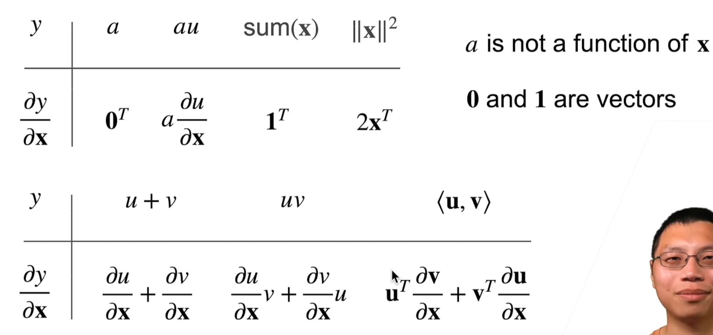
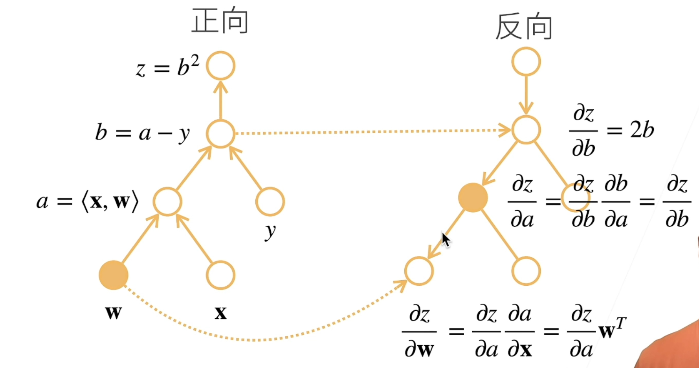
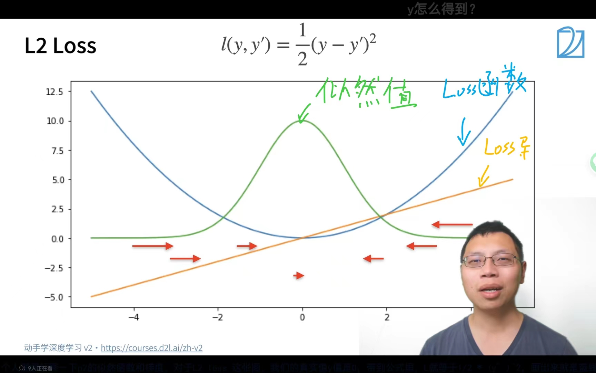

# 跟着李沐学AI

## 安装

注意，我们在这里安装只是需要一些简单的操作就好了，其实对于环境来说，我们使用windows或者是linux都是可以的，当然更推荐直接采用Linux，如果想要在Linux上玩GPU的话建议在服务器上操作！

### windows

我建议的是安装一个anaconda，直接去官网上安装，找新版，新版会做多引用和库间管理（类似于跨模块优化），安装见

[【精选】Anaconda超详细安装教程（Windows环境下）_conda安装-CSDN博客](https://blog.csdn.net/fan18317517352/article/details/123035625)

接着你就可以在anaconda的快速环境部署中畅游了！（你可以选择装非C盘，但这样会增加出错的风险，可以自行考虑）

> **注意！新版本的anaconda可能会有我们在使用Navigate的时候无法启动的问题，这里其实就是直接右键管理员模式运行就解决了**

接下来就是正菜了，使用anaconda。召出开始菜单


接着就在出现的黑窗口中输入：

```
conda create -n d2l-zh python=3.8
```

创建环境(注意其中的”**d2l-zh**“是你创建的环境名，是由在create后面的-n所赋予的，这个名字随意)

接着会出现询问，直接输入y

然后会自动开始创建环境

之后我们激活环境，还是在这个黑窗口中输入：

```
conda activate d2l-zh
```

接着我们会看到我们的输入命令的前缀由base变成了(d2l-zh)表明我们切换到了这个环境！

接着我们执行

```
pip install jupyter d2l
```

**注意！要与B站李沐老师视频中的直接写全会导致你会去安装出最新一版的pytorch可能会导致你无法安装gpu版本！（最新pytorch支持CUDA12.0系列我的CUDA11.7不支持力）**


接下来你就可以访问pytorch官网

[Previous PyTorch Versions | PyTorch](https://pytorch.org/get-started/previous-versions/)

从之前的版本中找到自己适合的，我自己选择的是1.13.1


然后就可以根据复制的信息直接在之前的黑窗口中粘贴安装对应版本

> **注意！你们一定要装CUDA，如果对于GPU pytorch安装不熟的移步**
>
> [Pytorch(GPU版)安装 - 知乎 (zhihu.com)](https://zhuanlan.zhihu.com/p/479848495)

然后你就装好他们了，验证一下


这样你环境就算配好了

接下来去下载d2l-zh和下载d2l-pytorch-sliders的方法视频中讲得很好，建议d2l-pytorch-sliders直接用GitHub Desktop下

### Linux

前面的anaconda换成安装miniconda就好了，或者你安装anaconda Linux版也可，但我觉得miniconda在linux上更适合，其余操作不变，就是如果你开服务器的话用wget下d2l-zh和git安装一下然后下d2l-pytorch-sliders

## N维数组

N维数组是机器学习神经网络的基础，也是主要数据结构

### 分类

#### 0-d（标量）

就是一个数字


在许多分类问题中他被当作是一种类别的特征，其实分类问题没那么玄乎，其实就是在分布图上画一条线，然后我们可以判断现在的这个值是在线的哪个部分然后我们就可以及逆行判断了

> e.g
>
> 我们判断任意的一个数字是否是一个负数？
>
> x>0正数 x<0负数
>
> 其实这就是原理，这既是一种最为简单的分类

#### 1-d（向量）

这是一个特征值（在机器学习中这样认为！）

其实就是我们在进行表述一个东西的时候我们如何去看待他们（就像我看到一个苹果，但是机器并不会遮掩更直接做出这种语言直接表述，那么他们其实是通过多个不同的特征来理解的【红色的】【有一定形状的】【口感脆脆甜甜的】【闻起来有特殊香气的】……那么人也是这样进行认知的，所以向量就是将我们人的认知的**某一项**归类抽象成为一组数字<为什么要高一组数字捏，直接一个值不好i吗，那当然可能会有问题，就像人判断一个味道是从酸，甜，苦，辣，咸多种味觉入手最终描绘出一个味道，其实这些向量上不同的值就对应于不同的特点，**而且向量多维度描述利于拓展**>，这就是特征向量的由来！）


#### 2-d（矩阵）

一个样本（由多个特征值组成）


其实这既是描述一个事物（样本了），我们可以由我前面的论述体现到，多特征向量合起来其实就是一个完整样本的表述力！！！（例如视觉+听觉+嗅觉+触觉……人们就可以描述出一个东西啦）

#### 3-d和4-d和5-d

这个其实就是分得更细了，其实就是相关联的东西变多了，表述同一个东西的描述空间更为宽广

> e.g
>
> RGB图片
>
> 其实就是说我们色觉正常的人是通过三原色判断各种颜色的，那么表述丰富了，看到的信息变多力！
>
> 如果我们看到的只是一个2-d矩阵（黑白图片）那我们看到的信息就更少了


#### n-d

其实d就是维度，一种表现相关数据的数据结构罢了，为多越多越丰富详实

例如：你听到这个人的名字，那么这是一个2-d的东西，你不太知道他，假如你看到他的图片（彩色）那就是3-d感知了，如果你看到他走过来那就是4-d动态感知也有了，你闻闻他，那就是5-d力，和他交流那知道的东西的维度多多得数不清了，那就是n-d啰。

**注意！d维度的分解是：要不相关的东西才能分成一个新维度哦，类似于数学上的要正交，要画x-y平面，x，y完全不相关，一个变化与另一个无关才好！**

### 创建数组

#### 形状

要给出一个具体形状（1x2或3x4或5x6x7……）

#### 要给出元素数据类型

这个是方便计算机做存储的（int float ）[整数，浮点数，定点小数……]

#### 元素的值

给出你给的元素的值

### 访问数组


李沐老师给出的表述法是基于python的，不同语言表述方式不一样哦

## 数据操作+数据预处理

### pytorch实操-数据操作

#### pytorch语法

首先先导入

```python
import torch as tor
```

生成一个数组

```python
import torch as tor #import就是导入，as是给torch取别名，之后tor就等于是torch库
x = tor.arange(12)  #arange(n)是生成一个从0到n-1的数组，例如n = 12，则生成的数组是0-11
x                   #用于显示
x.shape             #输出张量的形状
x.numel()           #输出数据的总数（永远是标量）
x.reshape(3,4)      #修改张量的形状而不改变元素的数量和元素值reshape(n,m,……)是将张量改成nxmx……的张量
x2 = tor.tensor([[[x11,y11,z11],[x21,y21,z21]],[[x12,y12,z12],[x22,y22,z22]]]) #套娃造变量
```

自己编程程序见[实操笔记](带代码的实操笔记极其函数库解\00数据操作和预处理\lib_know_data_operator.ipynb "这是一个实操笔记")

> 小贴士
>
> * 注意我们在编写函数时，这个类中最后一个成员函数的使用才是输出，例如：***x.tensor(……).shape***注意shape值才是输出哦
> * 注意我们在写tensor构建张量时，我们可以在元素中加入1.0等这种带有明显虚数意义的值可以使得整个tensor就会被认定为是浮点数^_^

### pytorch实操-数据预处理

数据预处理其实就是把我们非数值的数据变为数值型数据。这里我们主要使用的是pandas这个库。

具体实操看[实操笔记](带代码的实操笔记极其函数库解\00数据操作和预处理\lib_know_data_preprocessing.ipynb "这是一个实操笔记")

### 注意事项

见[实操笔记](带代码的实操笔记极其函数库解\00数据操作和预处理\lib_know_data_operator_preprocessing_tips.ipynb "这是一个实操笔记")

## 线性代数

线性代数是一个数学的基础，其实这里不会涉及过多的线性代数

### 标量

#### 简单操作

- $c = a + b$
- $ c =  a * b$
- $c = \sin\theta$

#### 长度

$$
|a|= \begin{cases}a&\text{a>0}\\-a&\text{other}\end{cases}
$$

$$
|a + b| \leqslant |a| + |b|
$$

$$
|a * b| = |a| * |b|
$$

### 向量

#### 简单操作

- $\vec{c} = \vec{a} + \vec{b} \quad where \quad c_i = a_i + b_i$
- $\vec{c} = k_{标量} \bullet \vec{b} \quad where \quad c_i = k_{标量} * b_i $
- $\vec{c} = \sin \vec{a} \quad where \quad c_i = \sin a_i$

#### 长度

$$
||\vec{a}||_2 = [\sum^{m}_{i = 1}a^2_i]^{\frac{1}{2}}
$$

$$
||\vec{a}|| \geqslant 0 \quad for \quad all \quad \vec{a}
$$

$$
||\vec{a} + \vec{b}|| \leqslant ||\vec{a}|| + ||\vec{b}||
$$

$$
||\vec{a} \bullet \vec{b}|| = |\vec{a}| \bullet ||\vec{b}||
$$


- 向量点乘$\vec{a^T} \times \vec{b} = \sum^{n}_{i}a_i*b_i$
- 正交判定$\vec{a^T} \times \vec{b} = 0$


### 矩阵

#### 简单操作

- $C = A + B \quad where \quad C_{ij} = A_{ij} + B_{ij}$
- $C = k_标量 \bullet B \quad where \quad C_{ij} = k_标量 * B_{ij} $
- $C = \sin A \quad where \quad C_{ij} = \sin A_{ij} $

#### 乘法

$$
\vec{c} = A \bullet \vec{b} \quad where \quad c_i = \sum_jA_{ij} * b_j
$$


$$
C = A \bullet B \quad where \quad C_{ik} = \sum_jA_{ij} * B_{ik}
$$


#### 范数

$$
\vec{c} = A \bullet \vec{b} \quad hence \quad ||\vec{c} \leqslant ||A|| \bullet ||\vec{b}||
$$

取决于如何衡量b和c的长度

##### 常见范数

- 矩阵范数：最小满足上述公式的值
- Frobenius范数
  $$
  ||A||_{Frob} = [\sum_{ij}A^2_{ij}]^{\frac{1}{2}}
  $$

#### 对称与反对称

$$
A_{ij} = A_{ji} 对称矩阵
$$

$$
A_{ij} = - A_{ji}反对称
$$

#### **正定**！！！！

$$
||x||^2 = x^T \bullet x \geqslant 0 \quad 推论得出 \quad x^T \bullet A \bullet x \geqslant 0
$$

#### 特殊矩阵

##### 正交矩阵

- 所有行都相互正交
- 所有行都有单位长度$U \quad wth \quad \sum_jU_{ij}*U_{kj} = \delta_{ik}$
- 可以写为$UU^T = 1$

##### 置换矩阵

$$
P \quad where \quad P_{ij} = 1 \quad if \space and \space only \space if \quad j = \pi(i)
$$

- 置换矩阵是正交矩阵

#### 特征向量和特征值


### 线性代数代码实现

代码实时操作(上课跟着做)见[operator](带代码的实操笔记极其函数库解\01线性代数\opreator_linear_algbra.ipynb "操作实时版本")

库操作解析(总结分析)见[Lib库解](带代码的实操笔记极其函数库解\01线性代数\lib_know_linear_algebra_make_true.ipynb "库解")

## 矩阵计算

### 求导数

#### 常见导数

|       $y$       | $a$ | $x^n$      | $e^x$ |    $ln(x)$    | $\sin(x)$ |
| :---------------: | ----- | ------------ | ------- | :-------------: | ----------- |
| $\frac{dy}{dx}$ | 0     | $nx^{n-1}$ | $e^x$ | $\frac{1}{x}$ | $\cos(x)$ |

tips: $a$不是$x$的函数

#### 多函数求导公式

求导公式:

| $y$             | $u + v$                         | $uv$                              |     $y = f(u),u = g(x)$     |
| ----------------- | --------------------------------- | ----------------------------------- | :----------------------------: |
| $\frac{dy}{dx}$ | $\frac{du}{dx} + \frac{dv}{dx}$ | $\frac{du}{dx}v + \frac{dv}{dx}u$ | $\frac{dy}{du}\frac{du}{dx}$ |

#### 亚导数(偏导数)$\partial$

- 发现导数不可微!


采用分段偏导的方法

$$
\frac{\partial {| x |}}{\partial{x}} = \begin{cases}
 1,\,\,\,x>0\\
 a,\,\,\,x = 0,\quad a \in [-1,1]\\
 -1,\,\,x<0\\
 \end{cases}
$$

- 另一个例子

$max(x,0)$函数

$$
\frac{\partial max(x,0)}{\partial x} = \begin{cases}
1,\,\,\,x > 0\\
a,\,\,\,x = 0,\quad a \in [0,1]\\
0,\,\,\,x < 0
\end{cases}
$$

### 向量求导




其实就是很简单的一个问题，我们可以发现！其实 $x_n$ 就是一个个维度，偏导其实可以理解为同纬度计算，非同纬度其实就是常熟，同纬度其实就是可以进行正常求导的玩意。

## 自动求导

### 链式法则

推荐李宏毅的视频。

#### 求导方法二则

##### 公式法

利用公式进行各种个样的操作

##### 数值法

其实就是将变量进行做差，求导项趋于0

#### 计算图


### 两种模式


> 例子
>
> 

反向算法总结(建议这一部分看李宏毅老师的课程)


我们其实可以在这里发现一个有趣的现象

- 我们的数据使用时，我们的顺向其实时一个符号计算，那么前因后果都要知道
- 反向计算其实是一个数值计算，啊u哦一我们就可以直接去存前面的数值就好了，不需要去将整个付哈哦体系都搞一遍

### 自动求导实现

详情见[实操笔记](带代码的实操笔记极其函数库解\02自动求导\lib_know_autograd.ipynb "实操笔记")

## 线性回归

### 引入：买房子


### 最优化方法

#### 梯度下降


我们其实就可以用一个公式来解决这问题

$$
w_t = w_{t - 1} - \eta*\frac{\partial loss}{\partial w_{t-1}}
$$

其中 $\eta$ 是一个**超参数(hyper parameter)**

超参数其实就是我们需要自己调整的参数，这个不是由机器学习可以优化得来的参数，这个$\eta$参数被乘称作学习率，用于表示迭代的幅度(直观体现就是快慢)

##### 梯度下降策略

对于学习率这个超参数的调整


对于如果我们要计算一个训练集上的上的loss，其实我们会因为要计算的数据过多就会导致我们的训练时间太长

> 例如一个集有1000_000_000个数据，首先我们要算出loss其实就是我们要将数据在模型中跑一遍获得一个值，这个值与正确值做比对得到loss，那么如果整个就要跑1000_000_000次！
>
> 于是未来使得我们的速度变快，我们就其实是采用分块的方式进行，这样我们可以进行一定程度的并行，这样我们可以在一个时间内做出更多的事。并且我们对于原始数据分批次训(就是缩小一次迭代所i需要计算的数据量)
>
> 
>
> 

梯度下降其实就是沿着反梯度的方向进行更新求解就好了。

### 线性回归算法从零实现

从零实现整个方法(带库的)

- 数据流水线
- 模型
- 损失函数
- 小批量随机梯度下降优化器

详见

[库解](带代码的实操笔记极其函数库解\03线性回归\lib_know_linear_regression-scartch.ipynb)

[实操笔记](带代码的实操笔记极其函数库解\03线性回归\operator_linear_regression-scartch.ipynb)

### 线性回归算法简洁实现

其实就是调用了一些库，会更快更简单，程序可读性更高

[库解](带代码的实操笔记极其函数库解\03线性回归\lib_know_linear_regression-easy.ipynb)

[实操笔记](带代码的实操笔记极其函数库解\03线性回归\operator_linear_regression-easy.ipynb)

## Softmax回归

这其实是做为一种分类模型去看的，是一种分类器

### 回归vs分类

- 回归是去预测一个未来的值
- 分类其实是去做一个函数然后依据我们的点在函数的哪个区域来决定是什么类别

#### 回归

- 单连续值输出
- 自然区间R
- 损失就是真实值与其预测值之差


#### 分类

- 输出多个值
- 其实就是多个不同类置信度(输出的值)


### 分类问题数学基础

对分类问题进行一位有效编码

> 例如：有n个类别，那么就是把一个做一个长为n的数组就好了
>
> $$
> y = [x_1, x_2 ,x_3……]
> $$
>
> 我们可有如下式子：
>
> $$
> y_i = \begin{cases} 1\quad if\quad i = y\\ 0\quad others \end{cases}
> $$
>
> 我们使用均方损失训练就是(差平方)
>
> 在进行选择时其实就是我们去选择最大的一个置信度的值就好了
>
> $$
> \hat{y} = argmax(o_i)
> $$

#### 无校验比例

就是我们在进行分类的时候可能会有一些数据是无效的，那么这款里就需要我们进行数据的的辨识，去筛除我们的无效的数据类(就是判别出来是类A，但其实不是，是因为他不在分类中，只是因为最像类A所以分为类A)


关注的是一个相对值

#### 校验比例


这里用到了通信中信息论的一个概念就是我们可以看到，其实在信息论中交叉熵就是两个信息的相关程度所以我们使用交叉熵作为损失函数。

其实原则还是差异分析罢了。

### 从零实现

这是一个深度学习中举足轻重的方法，这是一个实现，之后所有操作的举足轻重的方法

[从0到1实操笔记](带代码的实操笔记极其函数库解\04Softmax\operator_softmax_021.ipynb)

[简洁实现实操笔记](带代码的实操笔记极其函数库解\04Softmax\operator_softmax_easy.ipynb)

[softmax小贴士](带代码的实操笔记极其函数库解\04Softmax\softmax_tips.ipynb)

## 损失函数

损失函数其实对于机器学习而言时一个很重要的参数或者是配置点，其实就是我们有不少的论文就是通过修改损失函数以获得不同的效果，然后得以发表。

### L2 Loss

平方损失函数

$$
l(y,y') = \frac{1}{2}(y - y')^2
$$



更新速度随着距离会发生改变(远处更新速度过快，可能超调)

### L1 Loss

绝对值损失函数

$$
l(y,y') = | y - y'|
$$


更新速度随着距离不变，较为稳定(离正确点远的地方更新稳定，不会过大，但是近处更新可能有问题)

### Huber's Robust Loss

就是一个函数的融合

$$
Loss(y,y') = \begin{cases} |y - y'|\quad if\quad |y - y'| > 1\\ \frac{1}{2}(y - y')^2\quad others \end{cases}
$$


## 图片分类数据集(很重要，很多都搞，所以单独抽出来讲)

详情请见[实操笔记](带代码的实操笔记极其函数库解\04_1图像分类数据集\operator_image_Fashion-MNIST.ipynb)

当中我们使用了许多有关Fashion-MINIST的操作，现在是对于相关部分的整理，但这个篇章主要还是在实操这个是想抢请看[Fashion-MINIST函数抽象](带代码的实操笔记极其函数库解\04_1图像分类数据集\lib_know_image_Fashion-MINIST.ipynb)

## 多层感知机


### 感知机

- 感知机其实就是一个简单的二分类函数。或者说你可以将他认为是一种特殊的softmax

$$
o = \sigma(\langle \pmb w,\pmb x  \rangle + b) \, \,\,\,\,\,\,\,\, \sigma(x) = \begin{cases} 1 \quad \quad x > 0\\ -1 \quad 其他 \end{cases}
$$

- 这里只能做二分类问题
- 相比于线性回归输出的是实数，我们这里仅输出离散的值
- 相比于一般的softmax这里仅可以进行二分类问题


#### 感知机问题——XOR不可拟合

由于其是一个线性模型，所以对于分类只能进行画一条线，但是XOR问题明显是需要两条线所以嘎庙之机难以拟合他们(Minsky & Papert 1969年提出)


**导致了AI的第一次寒冬**

### 多层感知机

#### 学习XOR


注意这里再进行实际的操作时使用的方法其实是先对于x进行判断，在对于y及逆行判断

#### 隐藏层

其中我们可以看到就是我们的$f_1(x)……f_n(x)$其实就是我们说的 **hidden layer** (隐藏层)


对于h其实是有 $ h = \sigma(W_1x + b_1) $ 这样的数据作为一个输出的这是一个数值输出，其实就是搭建一个神经突触(激活函数其实就是我们的一种阶跃跳值方法，其实就是类似于使得我们的数据能够表示更多的函数可能)$ \sigma $ 是元素级激活函数。

接下来输出，其中有如果作为但分类那其实就是一个softmax那么其实还是计算一个数值 $ o = w^T_xh = b_2 $ 其中有意思的点其实就在于我们是有激活函数的只不过是直接放到了最后。

#### 多类分类


#### 多隐藏层


**每层有自己的激活函数对于隐藏层其实出来还是一个向量。**


超参数

- 隐藏层数
- 每层隐藏层的大小

##### 设计思路

其实我们可以看到我门在设计一个hidden layer的时候其实是我们自己对于数据进行相关的操作，我们可以看到一般在操作中我们是倾向于将一个数据进行一种由多变少的操作方法，我们可以看到有一些操作其实是我们在输入的第一层隐藏层我们会"展开"他们，就是将他们例如128个输入变化为256个第一级输入。我们一般在第一层不进行压缩，在后面的层中再进行压缩。第一层压缩后我们其实是担心数据还原不出来！另外，有的输入是在第一层进行了一些压缩的，其实是担心过拟合问题，就是为了这个去学这个(就像高考一样，高考就是在将学生进行机器学习，有时候就过拟合了，然后思路就被阻滞了，活化不了了，哈哈哈)，最终导致我们的模型在实际使用的时候我们无法得到很好的效果，但是在测试集上我们有相当的效果。

#### New Thinking**

机器学习其实可以看作时一种压缩其实就是将一个较为复杂的问题我们转到一个较为简单的输出中去！

信息提炼

#### 经典激活函数sigmoid


不采用阶跃函数而是采用 $ sigmoid = \frac{1}{1 + e^{-x}} $ 这个函数其实就是方便求导。(soft version)

#### 经典激活函数Tanh

**将输出投影到(-1,1)的阶跃函数**


注意其中的-2就是为了在求导数时方变计算。

#### 经典激活函数ReLU


用得最多，其实就是一个简单！

### 为什么我们使用deep而是使用fat

其实就是我们的在进行机器学习时我们可以看到一个有趣的点就是过拟合

过拟合会导致我们学的东西变为一种公式化，就像大家在高考时选择题的答题技巧("三短一长选最长，三长一短选最短，长长短短选BD，物理看到有”绝对“的字眼就是错的"等问题)，我们其实是希望模型去做解释，而不是去"投机取巧"，这是一个严重的问题。而当我们的参数变得fat而不是deep时，我们就会发现其实我们一口气想将数据并行，信息一并接入那么就会导致我们去**过度臆测**信息，导致我们overfitting

此外，deep更好训练


## 模型选择-过拟合-欠拟合

### 训练误差与泛化误差

- 训练误差：模型在训练数据上的误差(模拟)
- 泛化误差： 模型在新数据上的误差(实际用)

### 验证数据集与测试数据集

- 验证数据集：用于评估模型好坏的数据集（知结果，知道输入，但是并不训练他们）【一般的test data】
  **不要与训练数据集回到一起**（常犯错误）
- 测试数据集：只用一次的数据集（其实就是真实的情况了，遛遛模型）

#### K-则交叉验证


### 过拟合与欠拟合


- 模型复杂：就是这个模型的体量
- 数据复杂：就是这个数据集的大小

#### 模型容量

- 拟合各种函数的能力
- 低容量模型难以拟合训练数据
- 高容量模型可以记住更多的数据细节


##### 模型容量的影响


我们可以看到随着模型容量的上升，我们的**训练误差**疯狂下降(例如我们用与识别一个数据集中是猫还是狗，如果过大的模型就会直接记住每一个凸显更多编号，那就完蛋了！)，大容量的数据可能会不经意间放大噪声，最终导致我们的信息被错误的提取在最终出现问题。

我们还可以看到就是我们的泛化误差在先有下降再进行上升的，这就是因为我们的模型其实是应为当我们投入大量数据后产生的对于噪声也进行学习，这困扰了模型，导致他们最终泛化能力是会下降的。


#### 模型比较

不同种类间的模型是不好比较i的

给定一种模型，旗标叫方法主要有两个因素

- 参数的个数
- 参数值的选择范围

### VC维

- 统计学习理论的一个核心思想
- 对于一个分类模型，VC等于一个最大数据集的大小，不管如何给定标号，都存在一个模型对它进行完美分类(一个模型总是有方法记住数据集)


所以才说异或是一个AI寒冬


### 数据复杂度

#### 多个重要因素

- 样本个数
- 每个样本元素个数
- 时间、空间结构
- 多样性、

## 模型选择过拟合与欠拟合样例

直接见李沐老师的笔记

## 权重衰退--(处理过拟合的方法)

我们可以知道我们的模型容量其实是由

- 参数数量
- 参数选值范围

以上两点进行操作的

权重衰退聚焦于去做参数选值范围的操作进行防止过拟合

### 限制方法

#### 刚性限制


其实就是我们的数据对于 $w$ 作为一个限幅，其中 $\theta$ 数值的大小就体现了他们的约束力度。

#### 柔性限制

另一种方法是采用柔性限制(一般常用的方法)


对于上述操作的理解


对于该图的解释如下：

其中我们可以看到就是我们的 $w$ 这个参数在没有人掣肘的时候我们的参数值其实是可以遍布整个平面的，那么在这样的操作下就会导致我们你的数据选择就会过于宽泛。那么为了解决这个问题，我们就会引入 **$ \frac{ \lambda }{2}|| w||^2 $** 这个+项来自作为引导，这个就是途中黄色的部分，这是我们可以看到一个有趣的现象，就是我们找的最小值不仅是loss的最小值了，还有就是要权衡 $loss(w,b)+\frac{\lambda}{2}||w||^2$的最小，也就是说我们引入了 $||w||^2$这个值，我们的值还要受到那个weight权重大小的影响，因此这样的评判标准下weight权重就不会太大，这就无形中限制了权重的操作范围，nice！


这里我们就可以将这个权重衰退看得更为清楚，这里我们可以看到，由于我们之前引入了一个加绝对值的操作，那么我们在后续的更新时我们会多减去一个东西最终会导致最下面那个式子的效果 $ (1-\eta\lambda)w_t$ 原本数据更新时是去减 $w_t$ 的，现在变成了是减去一个小于原本weight的数值，这就是权重衰退！

### 权重衰退的现实实现的一些亮点

我们在进行权重衰退的现实的计算使用时我们会有一些区别就是我们将其中的 $\lambda$ 作为一个参数取入（一般取一个小值0.001等等)

## 丢弃法(dropout)

效果可能会比权重衰退要好

### 动机

一个好的模型需要对输入数据的扰动格鲁棒(噪声不敏感)

- 使用有噪音的数据等价于Tikhonov正则
- 丢弃法：在层之间加入噪音

#### 无偏差加入噪音

- 对于 **x** 有，加入噪音得到 **x'** ，我们希望：

  $$
  E[x'] = x
  $$

  也就是 **x'** 的期望仍等于 **x** 的期望
- 丢弃法对于每个元素进行如下扰动：

  

> 期望计算：$E(x') = 0 x p + (1-p)x\frac{x}{1-p}=x$


部分层中的数值变为了0

注意就是这个dropout仅在训练中使用，而在推理中是不使用的，也就是我们将最好的一个dropout出的一个直接作为模型，在推理过程中我们的模型各个参数并不发生改变。保证稳定输出。


基本不用于CNN上

0.5，0.9，0.7，0.1

## 数值稳定性


我们知道我们的数字的计算应用的是链式法则(开环求导)那么是一层层求下来的，那么就看可能会导致数值爆炸！

如果每个梯度大于1，一个100层的模型：$ 1.5^{100} \approx 4\times 10^{14}$

如果每个梯度小于1，一个100层的模型：$0.8^{100} \approx 2 \times 10^{-10}$

### 训练更稳定

- 目标：让梯度位于合理的范围内
- 乘法变加法
  ResNext，LSTM
- 归一化
  梯度归一化，进行裁剪(设限)
- 合理的权重初始化和激活函数

## 快速操作

### Pytorch搭建神经网络基础
